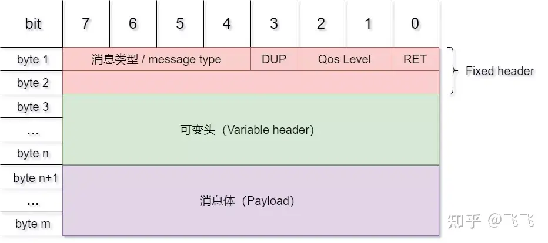
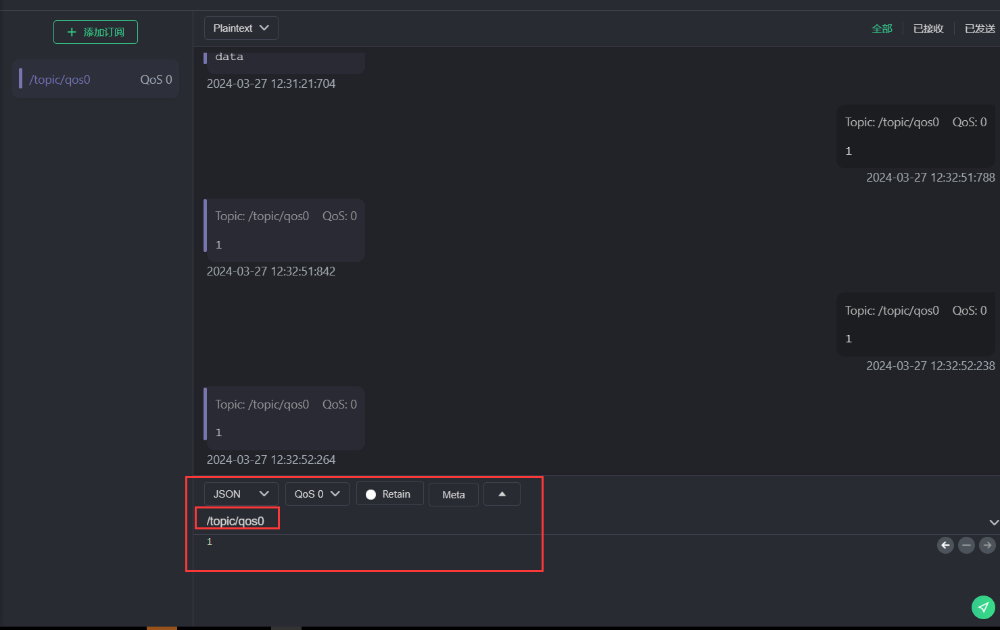

# MQTT 协议 | 让物联网设备轻松沟通 

## 一、介绍

> MQTT 与 HTTP 一样，MQTT 运行在传输控制协议/互联网协议 (TCP/IP) 堆栈之上。

### 1.1 MQTT介绍

> [MQTT官网](https://mqtt.org/)
> [MQTT 协议入门](https://www.emqx.com/zh/blog/the-easiest-guide-to-getting-started-with-mqtt)

MQTT（Message Queuing Telemetry Transport）是一种轻量级的、基于发布-订阅模式的通信协议，主要应用于物联网（IoT）领域中设备间的通信。


MQTT 协议采用了简单的二进制编码格式，使得它适用于网络带宽较小、延迟较高、网络不稳定的环境下进行通信。同时，MQTT 提供了 QoS（Quality of Service）服务质量保证机制，支持三种不同的 QoS 等级：

-   QoS 0：最多发送一次消息，不提供可靠性保证。
-   QoS 1：至少发送一次消息，确保消息能到达接收方，但可能会重复。
-   QoS 2：恰好发送一次消息，确保消息能到达接收方且只接收一次。

MQTT 协议的特点包括：可扩展性好、开销小、易于实现、开源、支持多种编程语言等。
在 MQTT 协议中，存在两个主要的参与者：**发布者**和**订阅者**。发布者将消息发布到一个或多个主题（Topic）中，订阅者可以订阅感兴趣的主题，从而接收到发布者发送的消息。**主题**可以看作是某一个特定类型的消息的分类标准。
MQTT 协议的使用场景包括但不限于：智能家居、智能灯光、智能安防、农业物联网、工业物联网等。

##### 优点

1. 轻巧高效: MQTT 客户端非常小，需要的资源最少，因此可以在小型微控制器上使用。MQTT 消息头很小，可以优化网络带宽。
2. 双向通信:MQTT 允许在设备到云和云到设备之间进行消息传递。这使得向事物组广播消息变得容易。
3. 扩展到数百万个事物:MQTT 可以扩展以连接数百万个物联网设备。
4. 可靠的消息传递:消息传递的可靠性对于许多物联网用例都很重要。这就是为什么 MQTT 有 3 个定义的服务质量级别：0 - 最多一次，1 - 至少一次，2 - 恰好一次
5. 支持不可靠的网络:许多物联网设备通过不可靠的蜂窝网络连接。MQTT 对持久会话的支持减少了将客户端与代理重新连接的时间。
6. 已启用安全性 :MQTT 使使用 TLS 加密消息和使用现代身份验证协议（如 OAuth）对客户端进行身份验证变得容易。

### 1.2 MQTT 数据包结构

- `固定头（Fixed header）`，存在于所有`MQTT`数据包中，表示数据包类型及数据包的分组类标识；
- `可变头（Variable header）`，存在于部分`MQTT`数据包中，数据包类型决定了可变头是否存在及其具体内容；
- `消息体（Payload）`，存在于部分`MQTT`数据包中，表示客户端收到的具体内容；



### 1.3 MQTT 其他概念

**一、订阅（Subscription）**

订阅包含主题筛选器（Topic Filter）和最大服务质量（QoS）。订阅会与一个会话（Session）关联。一个会话可以包含多个订阅。每一个会话中的每个订阅都有一个不同的主题筛选器。

**二、会话（Session）**

每个客户端与服务器建立连接后就是一个会话，客户端和服务器之间有状态交互。会话存在于一个网络之间，也可能在客户端和服务器之间跨越多个连续的网络连接。

**三、主题名（Topic Name）**

连接到一个应用程序消息的标签，该标签与服务器的订阅相匹配。服务器会将消息发送给订阅所匹配标签的每个客户端。

**四、主题筛选器（Topic Filter）**

一个对主题名通配符筛选器，在订阅表达式中使用，表示订阅所匹配到的多个主题。

**五、负载（Payload）**

消息订阅者所具体接收的内容。

详细内容可以查看MQTT协议文档：[MQTT Version 5.0](extension://bfdogplmndidlpjfhoijckpakkdjkkil/pdf/viewer.html?file=https%3A%2F%2Fdocs.oasis-open.org%2Fmqtt%2Fmqtt%2Fv5.0%2Fmqtt-v5.0.pdf)

### 1.4 ESP32的MQTT支持

>https://docs.espressif.com/projects/esp-idf/zh_CN/v5.1.3/esp32/api-reference/protocols/mqtt.html

- 支持基于 TCP 的 MQTT、基于 Mbed TLS 的 SSL、基于 WebSocket 的 MQTT 以及基于 WebSocket Secure 的 MQTT
- 通过 URI 简化配置流程
- 多个实例（一个应用程序中有多个客户端）
- 支持订阅、发布、认证、遗嘱消息、保持连接心跳机制以及 3 个服务质量 (QoS) 级别（组成全功能客户端）

## 二、使用

>示例代码参考:https://github.com/espressif/esp-idf/tree/master/examples/protocols/mqtt/tcp

#### 2.1 创建一个简单的MQTT服务器：

```c
// MQTT客户端
static void mqtt_app_start(void)
{
	esp_mqtt_client_config_t mqtt_cfg = {
			.broker.address.uri = CONFIG_BROKER_URL,
	};

	esp_mqtt_client_handle_t client = esp_mqtt_client_init(&mqtt_cfg);
	/* The last argument may be used to pass data to the event handler, in this example mqtt_event_handler */
	// 注册事件处理函数
	esp_mqtt_client_register_event(client, ESP_EVENT_ANY_ID, mqtt_event_handler, NULL);
	// 启动MQTT客户端
	esp_mqtt_client_start(client);
}
```

代码很简单这里就不展开说了。

#### 2.2 事件处理

事件处理部分是重点：

代码：
```c
// MQTT客户端事件处理
/*
 * @brief Event handler registered to receive MQTT events
 *
 *  This function is called by the MQTT client event loop.
 *
 * @param handler_args user data registered to the event.
 * @param base Event base for the handler(always MQTT Base in this example).
 * @param event_id The id for the received event.
 * @param event_data The data for the event, esp_mqtt_event_handle_t.
 */
static void mqtt_event_handler(void *handler_args, esp_event_base_t base, int32_t event_id, void *event_data)
{
	ESP_LOGD(TAG, "Event dispatched from event loop base=%s, event_id=%" PRIi32 "", base, event_id);
	esp_mqtt_event_handle_t event = event_data;
	esp_mqtt_client_handle_t client = event->client;
	int msg_id;
	switch ((esp_mqtt_event_id_t)event_id)
	{
	// MQTT连接成功
	case MQTT_EVENT_CONNECTED:
		ESP_LOGI(TAG, "MQTT_EVENT_CONNECTED");
		// 发布消息
		msg_id = esp_mqtt_client_publish(client, "/topic/qos1", "data_3", 0, 1, 0);
		ESP_LOGI(TAG, "sent publish successful, msg_id=%d", msg_id);
		// 订阅消息
		msg_id = esp_mqtt_client_subscribe(client, "/topic/qos0", 0);
		ESP_LOGI(TAG, "sent subscribe successful, msg_id=%d", msg_id);
		msg_id = esp_mqtt_client_subscribe(client, "/topic/qos1", 1);
		ESP_LOGI(TAG, "sent subscribe successful, msg_id=%d", msg_id);
		// 取消订阅消息
		msg_id = esp_mqtt_client_unsubscribe(client, "/topic/qos1");
		ESP_LOGI(TAG, "sent unsubscribe successful, msg_id=%d", msg_id);
		break;
	// MQTT连接断开
	case MQTT_EVENT_DISCONNECTED:
		ESP_LOGI(TAG, "MQTT_EVENT_DISCONNECTED");
		break;
	// MQTT订阅成功
	case MQTT_EVENT_SUBSCRIBED:
		ESP_LOGI(TAG, "MQTT_EVENT_SUBSCRIBED, msg_id=%d", event->msg_id);
		// 发布消息
		msg_id = esp_mqtt_client_publish(client, "/topic/qos0", "data", 0, 0, 0);
		ESP_LOGI(TAG, "sent publish successful, msg_id=%d", msg_id);
		break;
	// MQTT取消订阅成功
	case MQTT_EVENT_UNSUBSCRIBED:
		ESP_LOGI(TAG, "MQTT_EVENT_UNSUBSCRIBED, msg_id=%d", event->msg_id);
		break;
	// MQTT发布成功
	case MQTT_EVENT_PUBLISHED:
		ESP_LOGI(TAG, "MQTT_EVENT_PUBLISHED, msg_id=%d", event->msg_id);
		break;
	// MQTT收到数据
	case MQTT_EVENT_DATA:
		ESP_LOGI(TAG, "MQTT_EVENT_DATA");
		printf("TOPIC=%.*s\r\n", event->topic_len, event->topic);
		printf("DATA=%.*s\r\n", event->data_len, event->data);
		break;
	// MQTT错误
	case MQTT_EVENT_ERROR:
		ESP_LOGI(TAG, "MQTT_EVENT_ERROR");
		if (event->error_handle->error_type == MQTT_ERROR_TYPE_TCP_TRANSPORT)
		{
			log_error_if_nonzero("reported from esp-tls", event->error_handle->esp_tls_last_esp_err);
			log_error_if_nonzero("reported from tls stack", event->error_handle->esp_tls_stack_err);
			log_error_if_nonzero("captured as transport's socket errno", event->error_handle->esp_transport_sock_errno);
			ESP_LOGI(TAG, "Last errno string (%s)", strerror(event->error_handle->esp_transport_sock_errno));
		}
		break;
	default:
		ESP_LOGI(TAG, "Other event id:%d", event->event_id);
		break;
	}
}
```

- `MQTT_EVENT_CONNECTED`: 处理MQTT客户端成功连接到代理时的事件。在此情况下，它展示了如何发布、订阅和取消订阅MQTT主题。
- `MQTT_EVENT_DISCONNECTED`: 处理MQTT客户端与代理断开连接时的事件。
- `MQTT_EVENT_SUBSCRIBED`: 处理MQTT客户端成功订阅主题时的事件。
- `MQTT_EVENT_UNSUBSCRIBED`: 处理MQTT客户端成功取消订阅主题时的事件。
- `MQTT_EVENT_PUBLISHED`: 处理MQTT客户端成功发布消息时的事件。
- `MQTT_EVENT_DATA`: 处理收到来自代理的数据时的事件。在此情况下，它打印了主题和数据。
- `MQTT_EVENT_ERROR`: 处理MQTT客户端发生错误时的事件。

## 三、实例


这里使用我自己的MQTT服务器测试：`mqtt://www.duruofu.com:1883`

```c
#include <stdio.h>
#include <stdint.h>
#include <stddef.h>
#include <string.h>
#include "freertos/FreeRTOS.h"
#include "freertos/event_groups.h"
#include "esp_wifi.h"
#include "esp_log.h"
#include "esp_event.h"
#include "nvs_flash.h"
#include "esp_mac.h"
#include "esp_netif.h"
#include <sys/socket.h>
#include "esp_eth.h"
#include "lwip/sockets.h"
#include "lwip/dns.h"
#include "lwip/netdb.h"
#include "mqtt_client.h"


// 要连接的WIFI
#define ESP_WIFI_STA_SSID "duruofu_win10"
#define ESP_WIFI_STA_PASSWD "1234567890"

static const char *TAG = "main";


void WIFI_CallBack(void *event_handler_arg, esp_event_base_t event_base, int32_t event_id, void *event_data)
{
	static uint8_t connect_count = 0;
	// WIFI 启动成功
	if (event_base == WIFI_EVENT && event_id == WIFI_EVENT_STA_START)
	{
		ESP_LOGI("WIFI_EVENT", "WIFI_EVENT_STA_START");
		ESP_ERROR_CHECK(esp_wifi_connect());
	}
	// WIFI 连接失败
	if (event_base == WIFI_EVENT && event_id == WIFI_EVENT_STA_DISCONNECTED)
	{
		ESP_LOGI("WIFI_EVENT", "WIFI_EVENT_STA_DISCONNECTED");
		connect_count++;
		if (connect_count < 6)
		{
			vTaskDelay(1000 / portTICK_PERIOD_MS);
			ESP_ERROR_CHECK(esp_wifi_connect());
		}
		else
		{
			ESP_LOGI("WIFI_EVENT", "WIFI_EVENT_STA_DISCONNECTED 10 times");
		}
	}
	// WIFI 连接成功(获取到了IP)
	if (event_base == IP_EVENT && event_id == IP_EVENT_STA_GOT_IP)
	{
		ESP_LOGI("WIFI_EVENT", "WIFI_EVENT_STA_GOT_IP");
		ip_event_got_ip_t *info = (ip_event_got_ip_t *)event_data;
		ESP_LOGI("WIFI_EVENT", "got ip:" IPSTR "", IP2STR(&info->ip_info.ip));
	}
}

// wifi初始化
static void wifi_sta_init(void)
{
	ESP_ERROR_CHECK(esp_netif_init());

	// 注册事件(wifi启动成功)
	ESP_ERROR_CHECK(esp_event_handler_instance_register(WIFI_EVENT, WIFI_EVENT_STA_START, WIFI_CallBack, NULL, NULL));
	// 注册事件(wifi连接失败)
	ESP_ERROR_CHECK(esp_event_handler_instance_register(WIFI_EVENT, WIFI_EVENT_STA_DISCONNECTED, WIFI_CallBack, NULL, NULL));
	// 注册事件(wifi连接失败)
	ESP_ERROR_CHECK(esp_event_handler_instance_register(IP_EVENT, IP_EVENT_STA_GOT_IP, WIFI_CallBack, NULL, NULL));

	// 初始化STA设备
	esp_netif_create_default_wifi_sta();

	/*Initialize WiFi */
	wifi_init_config_t cfg = WIFI_INIT_CONFIG_DEFAULT();
	// WIFI_INIT_CONFIG_DEFAULT 是一个默认配置的宏

	ESP_ERROR_CHECK(esp_wifi_init(&cfg));

	//----------------配置阶段-------------------
	// 初始化WIFI设备( 为 WiFi 驱动初始化 WiFi 分配资源，如 WiFi 控制结构、RX/TX 缓冲区、WiFi NVS 结构等，这个 WiFi 也启动 WiFi 任务。必须先调用此API，然后才能调用所有其他WiFi API)
	ESP_ERROR_CHECK(esp_wifi_set_mode(WIFI_MODE_STA));

	// STA详细配置
	wifi_config_t sta_config = {
			.sta = {
					.ssid = ESP_WIFI_STA_SSID,
					.password = ESP_WIFI_STA_PASSWD,
					.bssid_set = false,
			},
	};
	ESP_ERROR_CHECK(esp_wifi_set_config(WIFI_IF_STA, &sta_config));

	//----------------启动阶段-------------------
	ESP_ERROR_CHECK(esp_wifi_start());

	//----------------配置省电模式-------------------
	// 不省电(数据传输会更快)
	ESP_ERROR_CHECK(esp_wifi_set_ps(WIFI_PS_NONE));
}

static void log_error_if_nonzero(const char *message, int error_code)
{
	if (error_code != 0)
	{
		ESP_LOGE(TAG, "Last error %s: 0x%x", message, error_code);
	}
}


// MQTT客户端事件处理
/*
 * @brief Event handler registered to receive MQTT events
 *
 *  This function is called by the MQTT client event loop.
 *
 * @param handler_args user data registered to the event.
 * @param base Event base for the handler(always MQTT Base in this example).
 * @param event_id The id for the received event.
 * @param event_data The data for the event, esp_mqtt_event_handle_t.
 */
static void mqtt_event_handler(void *handler_args, esp_event_base_t base, int32_t event_id, void *event_data)
{
	ESP_LOGD(TAG, "Event dispatched from event loop base=%s, event_id=%" PRIi32 "", base, event_id);
	esp_mqtt_event_handle_t event = event_data;
	esp_mqtt_client_handle_t client = event->client;
	int msg_id;
	switch ((esp_mqtt_event_id_t)event_id)
	{
	// MQTT连接成功
	case MQTT_EVENT_CONNECTED:
		ESP_LOGI(TAG, "MQTT_EVENT_CONNECTED");
		// 发布消息
		msg_id = esp_mqtt_client_publish(client, "/topic/qos1", "data_3", 0, 1, 0);
		ESP_LOGI(TAG, "sent publish successful, msg_id=%d", msg_id);
		// 订阅消息
		msg_id = esp_mqtt_client_subscribe(client, "/topic/qos0", 0);
		ESP_LOGI(TAG, "sent subscribe successful, msg_id=%d", msg_id);
		msg_id = esp_mqtt_client_subscribe(client, "/topic/qos1", 1);
		ESP_LOGI(TAG, "sent subscribe successful, msg_id=%d", msg_id);
		// 取消订阅消息
		msg_id = esp_mqtt_client_unsubscribe(client, "/topic/qos1");
		ESP_LOGI(TAG, "sent unsubscribe successful, msg_id=%d", msg_id);
		break;
	// MQTT连接断开
	case MQTT_EVENT_DISCONNECTED:
		ESP_LOGI(TAG, "MQTT_EVENT_DISCONNECTED");
		break;
	// MQTT订阅成功
	case MQTT_EVENT_SUBSCRIBED:
		ESP_LOGI(TAG, "MQTT_EVENT_SUBSCRIBED, msg_id=%d", event->msg_id);
		// 发布消息
		msg_id = esp_mqtt_client_publish(client, "/topic/qos0", "data", 0, 0, 0);
		ESP_LOGI(TAG, "sent publish successful, msg_id=%d", msg_id);
		break;
	// MQTT取消订阅成功
	case MQTT_EVENT_UNSUBSCRIBED:
		ESP_LOGI(TAG, "MQTT_EVENT_UNSUBSCRIBED, msg_id=%d", event->msg_id);
		break;
	// MQTT发布成功
	case MQTT_EVENT_PUBLISHED:
		ESP_LOGI(TAG, "MQTT_EVENT_PUBLISHED, msg_id=%d", event->msg_id);
		break;
	// MQTT收到数据
	case MQTT_EVENT_DATA:
		ESP_LOGI(TAG, "MQTT_EVENT_DATA");
		printf("TOPIC=%.*s\r\n", event->topic_len, event->topic);
		printf("DATA=%.*s\r\n", event->data_len, event->data);
		break;
	// MQTT错误
	case MQTT_EVENT_ERROR:
		ESP_LOGI(TAG, "MQTT_EVENT_ERROR");
		if (event->error_handle->error_type == MQTT_ERROR_TYPE_TCP_TRANSPORT)
		{
			log_error_if_nonzero("reported from esp-tls", event->error_handle->esp_tls_last_esp_err);
			log_error_if_nonzero("reported from tls stack", event->error_handle->esp_tls_stack_err);
			log_error_if_nonzero("captured as transport's socket errno", event->error_handle->esp_transport_sock_errno);
			ESP_LOGI(TAG, "Last errno string (%s)", strerror(event->error_handle->esp_transport_sock_errno));
		}
		break;
	default:
		ESP_LOGI(TAG, "Other event id:%d", event->event_id);
		break;
	}
}

// MQTT客户端
static void mqtt_app_start(void)
{
	esp_mqtt_client_config_t mqtt_cfg = {
			.broker.address.uri = "mqtt://www.duruofu.top:1883",
	};

	esp_mqtt_client_handle_t client = esp_mqtt_client_init(&mqtt_cfg);
	/* The last argument may be used to pass data to the event handler, in this example mqtt_event_handler */
	// 注册事件处理函数
	esp_mqtt_client_register_event(client, ESP_EVENT_ANY_ID, mqtt_event_handler, NULL);
	// 启动MQTT客户端
	esp_mqtt_client_start(client);
}

void app_main(void)
{

	// Initialize NVS
	esp_err_t ret = nvs_flash_init();
	if (ret == ESP_ERR_NVS_NO_FREE_PAGES || ret == ESP_ERR_NVS_NEW_VERSION_FOUND)
	{
		ESP_ERROR_CHECK(nvs_flash_erase());
		ret = nvs_flash_init();
	}
	ESP_ERROR_CHECK(ret);

	// 创建默认事件循环
	ESP_ERROR_CHECK(esp_event_loop_create_default());

	// 配置启动WIFI
	wifi_sta_init();

	// 等待wifi连接成功(暂时这样处理)
	vTaskDelay(5000 / portTICK_PERIOD_MS);

	// 创建MQTT客户端
	mqtt_app_start();
}

```

使用MQTTX来充当另一个客户端:


成功收到消息，如上图

尝试发送数据，ESP会将数据返回：




这样就完成了简单的MQTT客户端程序。

# 参考链接

1. https://docs.espressif.com/projects/esp-idf/zh_CN/v5.1.3/esp32/api-reference/protocols/mqtt.html
2. https://github.com/espressif/esp-idf/blob/master/examples/protocols/mqtt/tcp/main/app_main.c