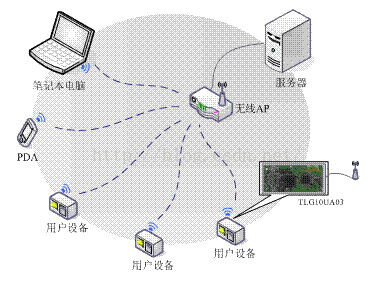
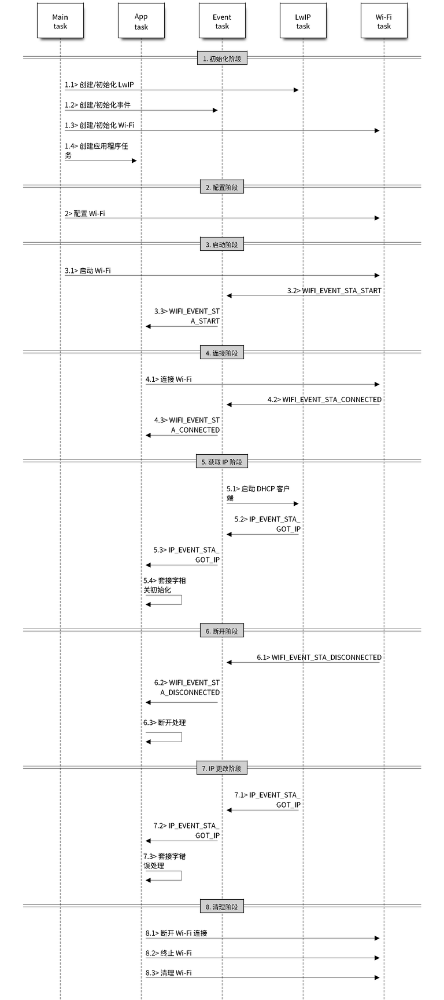
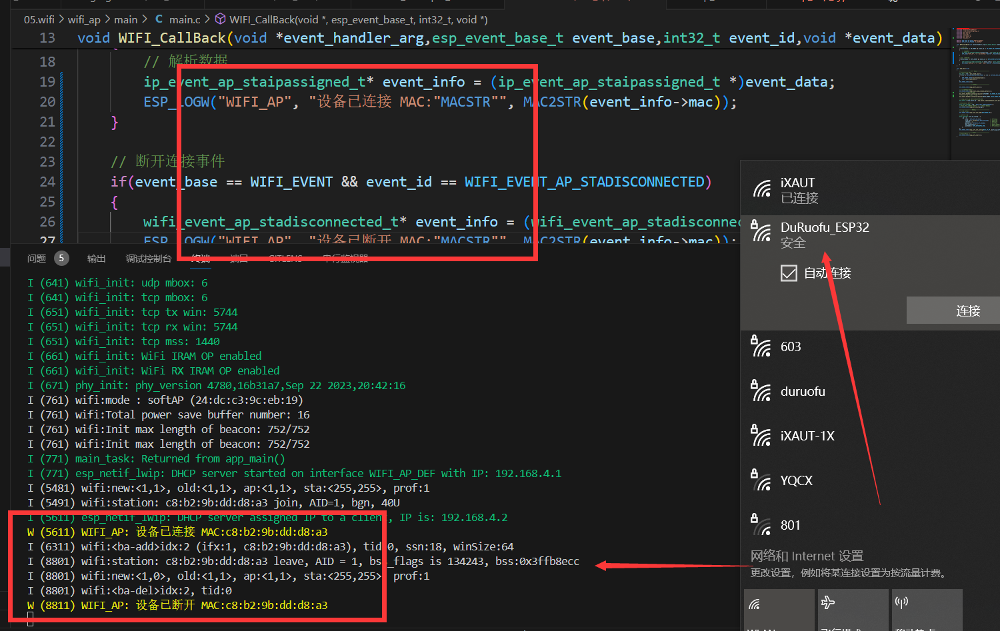

# WIFI BASICS

!!! NOTE "References"
    This document is based on the DURUOFU's ESP32-GUIDE. For more information, please refer to the original version: [DURUOFU ESP32-GUIDE](https://github.com/DuRuofu/ESP32-Guide).

This chapter will introduce how to use wifi on ESP32, including WIFI AP mode and WIFI STA mode.

## 1. Introduction

Before using Wi-Fi, we need to master some basic concepts and prerequisites:

> The most fundamental point: Wi-Fi pertains to the physical and data link layers. It replaces Ethernet cables and switch ports by transmitting and receiving information through radio waves. In other words, the Wi-Fi discussed here does not yet involve network layer protocols.

### 1.1 ESP32 Event Mechanism

> If you have no knowledge of FreeRTOS multithreading, please familiarize yourself with it first. You can refer to: [What is a Thread?](https://www.bilibili.com/video/BV1au411E7K1?p=7)

For a general understanding of the event loop, please refer to the following links:

1. [ESP32 Event Loop](https://docs.espressif.com/projects/esp-idf/zh_CN/latest/esp32/api-reference/system/esp_event.html)
2. [Event Loop Explained in Plain Language](https://www.bilibili.com/video/BV1FD4y1j79J/?spm_id_from=333.788&vd_source=ef5a0ab0106372751602034cdd9ab98e)

### 1.2 ESP32 WIFI's STA and AP Modes

#### 1.2.1 AP

An AP (Access Point) is a wireless access point, the creator of a wireless network and its central node. Typically, a wireless router used in a home or office is an AP.



#### 1.2.2 STA

A STA (Station) refers to any terminal that connects to a wireless network, such as a laptop, PDA, or any other network-capable device.


## 2. Usage

> Reference: [ESP-IDF: Wi-Fi Driver](https://docs.espressif.com/projects/esp-idf/zh_CN/latest/esp32/api-guides/wifi.html)

The ESP-IDF WiFi library provides the following features:

- Supports station-only mode, AP-only mode, and station/AP coexistence mode
- Supports IEEE 802.11b, IEEE 802.11g, IEEE 802.11n, and protocol modes configured via API
- Supports WPA/WPA2/WPA3/WPA2-Enterprise/WPA3-Enterprise/WAPI/WPS and DPP
- Supports AMSDU, AMPDU, HT40, QoS, and other key features
- Supports Espressif proprietary protocol, enabling data communication over **1 km**
- Achieves over-the-air data transmission with a maximum TCP throughput of 20 MBit/s and UDP throughput of 30 MBit/s
- Supports fast scanning and full-channel scanning
- Supports obtaining channel status information

!!! tip "Campus Wi-Fi"
    Note: Many institutions or schools have campus networks similar to home Wi-Fi. For example, at Nanyang Technological University, the campus network uses WPA2-Enterprise mode, so you need to use WPA2-Enterprise when connecting to the campus network.

### 2.1 WIFI AP Mode

> The official example program is located at:  
> `Espressif\frameworks\esp-idf-v4.4.3\examples\wifi\getting_started\softAP`

The configuration process is as follows:

- `nvs_flash_init`: Initialize the default NVS partition.
- `esp_netif_init`: Initialize the underlying TCP/IP stack (create a LwIP core task and initialize LwIP related operations).
- `esp_event_loop_create_default`: Create the default event loop.
- `esp_netif_create_default_wifi_ap`: Create an esp_netif object using the default WiFi AP configuration, connect the netif to WiFi, and register the default WiFi handler.
- `esp_wifi_init`: Initialize WiFi by allocating resources for the WiFi driver, such as the WiFi control structure, RX/TX buffers, WiFi NVS structure, etc. This also starts the WiFi task. You must call this API before calling any other WiFi APIs.
- `esp_event_handler_instance_register`: Listen for any WiFi events (WIFI_EVENT); upon triggering, the callback function is executed.
- `esp_wifi_set_mode`: Set the WiFi operating mode to station, soft-AP, or station + soft-AP. The default mode is soft-AP. This program sets it to AP.
- `esp_wifi_set_config`: Set the configuration for the ESP32 STA or AP.
- `esp_wifi_start`: Start WiFi based on the configuration.

The working process is illustrated in the diagram below:  
(If you don't understand it, you can ignore it, as you'll gradually learn by using it. You can also refer to [Michael_ee](https://space.bilibili.com/1338335828)'s tutorial: [WIFI Hotspot Working Process](https://www.bilibili.com/video/BV1ye4y1r7XK/?spm_id_from=333.788&vd_source=ef5a0ab0106372751602034cdd9ab98e))


The main process is divided into the following parts (diagram from the official tutorial):


#### 2.1.1 Wi-Fi Preparation Phase (Not shown in the diagram)

In this phase, we need to initialize the NVS since the WiFi library relies on it. For more details about NVS, please refer to this blog: [ESP32 Storage - 3. VFS Virtual File System](https://www.duruofu.top/2024/03/06/4.%E7%A1%AC%E4%BB%B6%E7%9B%B8%E5%85%B3/MCU/ESP32/04.ESP32%E5%AD%98%E5%82%A8%E5%99%A8%E5%85%A5%E9%97%A8/4.3-ESP32%E5%AD%98%E5%82%A8-VFS%E6%96%87%E4%BB%B6%E7%B3%BB%E7%BB%9F/ESP32%E5%AD%98%E5%82%A8-VFS%E8%99%9A%E6%8B%9F%E6%96%87%E4%BB%B6%E7%B3%BB%E7%BB%9F%E5%85%A5%E9%97%A8/)

Below is the code snippet:

```c
// Initialize NVS
esp_err_t ret = nvs_flash_init();
if (ret == ESP_ERR_NVS_NO_FREE_PAGES || ret == ESP_ERR_NVS_NEW_VERSION_FOUND) {
    ESP_ERROR_CHECK(nvs_flash_erase());
    ret = nvs_flash_init();
}
ESP_ERROR_CHECK( ret );
```

#### 2.1.2 Wi-Fi Initialization Phase

This phase mainly consists of the following steps:

- The main task calls the function [`esp_netif_init()`](https://docs.espressif.com/projects/esp-idf/zh_CN/latest/esp32/api-reference/network/esp_netif.html#_CPPv414esp_netif_initv "esp_netif_init") to create a LwIP core task and initialize LwIP-related operations.
- The main task calls the function [`esp_event_loop_create()`](https://docs.espressif.com/projects/esp-idf/zh_CN/latest/esp32/api-reference/system/esp_event.html#_CPPv421esp_event_loop_createPK21esp_event_loop_args_tP23esp_event_loop_handle_t "esp_event_loop_create") to create a system event task and initialize the application's event callback function. In this case, the only action of the callback is to relay the event to the application task.
- The main task calls the function [`esp_netif_create_default_wifi_ap()`](https://docs.espressif.com/projects/esp-idf/zh_CN/latest/esp32/api-reference/network/esp_netif.html#_CPPv432esp_netif_create_default_wifi_apv "esp_netif_create_default_wifi_ap") or [`esp_netif_create_default_wifi_sta()`](https://docs.espressif.com/projects/esp-idf/zh_CN/latest/esp32/api-reference/network/esp_netif.html#_CPPv433esp_netif_create_default_wifi_stav "esp_netif_create_default_wifi_sta") to create a default network interface instance with a TCP/IP stack, binding to either a station or an AP.
- The main task calls the function [`esp_wifi_init()`](https://docs.espressif.com/projects/esp-idf/zh_CN/latest/esp32/api-reference/network/esp_wifi.html#_CPPv413esp_wifi_initPK18wifi_init_config_t "esp_wifi_init") to create the Wi-Fi driver task and initialize the Wi-Fi driver.
- The main task creates the application task by calling the OS API.

Code:

```c
ESP_ERROR_CHECK(esp_netif_init());

ESP_ERROR_CHECK(esp_event_loop_create_default());

// *esp_netif_ap can be used to modify AP settings
esp_netif_t *esp_netif_ap = esp_netif_create_default_wifi_ap();

/* Initialize WiFi */ 
wifi_init_config_t cfg = WIFI_INIT_CONFIG_DEFAULT();
// WIFI_INIT_CONFIG_DEFAULT is a macro for the default configuration

ESP_ERROR_CHECK(esp_wifi_init(&cfg));
```

This completes the Wi-Fi initialization.

#### 2.1.3 Wi-Fi Configuration Phase

After the Wi-Fi driver is successfully initialized, we can proceed to the configuration phase.

Use the function `esp_wifi_set_mode` to set the WiFi operation mode to station, soft-AP, or station+soft-AP.

Use the function `esp_wifi_set_config` to set the specific configuration for the ESP32 STA or AP (there are many parameters available; please refer to the official documentation for details. Below, only a few basic parameters are configured).

```c
// Set to AP mode
ESP_ERROR_CHECK(esp_wifi_set_mode(WIFI_MODE_AP));

// Detailed AP configuration
wifi_config_t wifi_ap_config = {
    .ap = {
        .ssid = ESP_WIFI_AP_SSID,              // Wi-Fi name
        .ssid_len = strlen(ESP_WIFI_AP_SSID),    // Name length
        .channel = 1,                          // Wi-Fi channel
        .password = ESP_WIFI_AP_PASSWD,          // Wi-Fi password
        .max_connection = 5,                   // Maximum number of connections (default is 10)
        .authmode = WIFI_AUTH_WPA2_PSK,          // Wi-Fi authentication mode
    },
};
ESP_ERROR_CHECK(esp_wifi_set_config(WIFI_IF_AP, &wifi_ap_config));
```

Only the basic parameters are configured here.

#### 2.1.4 Wi-Fi Startup Phase

Use `esp_wifi_start` to start the Wi-Fi based on the configuration.

```c
/* Start WiFi */
ESP_ERROR_CHECK(esp_wifi_start());
```

This completes a basic Wi-Fi AP.

However, this is just the most basic program. How do we know within the program when an external STA device connects or disconnects? For that, we need to use the default event loop created earlier.

#### 2.1.5 Event Loop

Call [`esp_event_handler_instance_register`](https://docs.espressif.com/projects/esp-idf/zh_CN/latest/esp32/api-reference/system/esp_event.html#_CPPv431esp_event_handler_register_with23esp_event_loop_handle_t16esp_event_base_t7int32_t19esp_event_handler_tPv "esp_event_handler_register_with") to register an event handler with the default event loop. It functions the same as the `esp_event_handler_instance_register_with` function, with the only difference being that it registers the handler to the default event loop.

```c
esp_err_t esp_event_handler_instance_register(esp_event_base_t event_base,
                                             int32_t event_id,
                                             esp_event_handler_t event_handler,
                                             void *event_handler_arg,
                                             esp_event_handler_instance_t *instance);
```

The parameters are as follows:
- **event_base**: The base ID of the event for which the handler is being registered.
- **event_id**: The ID of the event for which the handler is registered.
- **event_handler**: The handler function that is called when the event is dispatched.
- **event_handler_arg**: Additional data (other than the event data) passed to the handler function.
- **instance**: The event handler instance object associated with the registered event handler and its data.

The related event descriptions can be found in the esp-idf files:


After creating the default event loop, we can add event handling as follows:

```c
void WIFI_CallBack(void *event_handler_arg, esp_event_base_t event_base, int32_t event_id, void *event_data)
{
    // Connection event
    if (event_base == IP_EVENT && event_id == IP_EVENT_AP_STAIPASSIGNED)
    {
        // Parse data
        ip_event_ap_staipassigned_t* event_info = (ip_event_ap_staipassigned_t *)event_data;
        ESP_LOGW("WIFI_AP", "Device connected, MAC:" MACSTR "", MAC2STR(event_info->mac));
    }

    // Disconnection event
    if (event_base == WIFI_EVENT && event_id == WIFI_EVENT_AP_STADISCONNECTED)
    {
        wifi_event_ap_stadisconnected_t* event_info = (wifi_event_ap_stadisconnected_t*)event_data;
        ESP_LOGW("WIFI_AP", "Device disconnected, MAC:" MACSTR "", MAC2STR(event_info->mac));
    }
}

void app_main(void)
{
    // ......

    // Initialize the default event loop
    ESP_ERROR_CHECK(esp_event_loop_create_default());
    // Register the device connection event callback
    esp_event_handler_instance_register(IP_EVENT, IP_EVENT_AP_STAIPASSIGNED, WIFI_CallBack, NULL, NULL);
    // Register the device disconnection event callback
    esp_event_handler_instance_register(WIFI_EVENT, WIFI_EVENT_AP_STADISCONNECTED, WIFI_CallBack, NULL, NULL);

    // ......
}
```

We registered the IP_EVENT_AP_STAIPASSIGNED event here. When a STA device connects or disconnects, the WIFI_CallBack callback function is invoked to print the MAC address information of the connected device.

### 2.2 WIFI STA

> The official sample code is located at (similar to the hotspot process, but with some differences in details):  
`Espressif\frameworks\esp-idf-v4.4.3\examples\wifi\getting_started\station`

The configuration steps in the initial part are basically the same.

Below is the high-level flow of the official program:



#### 2.2.1 Wi-Fi Preparation Phase (Same as in AP)

Initialize NVS:

```c
// Initialize NVS
esp_err_t ret = nvs_flash_init();
if (ret == ESP_ERR_NVS_NO_FREE_PAGES || ret == ESP_ERR_NVS_NEW_VERSION_FOUND) {
    ESP_ERROR_CHECK(nvs_flash_erase());
    ret = nvs_flash_init();
}
ESP_ERROR_CHECK( ret );
```

#### 2.2.2 Wi-Fi Initialization Phase

This configuration differs from the AP setup, as we need to set the device to STA mode.

The only difference is replacing `esp_netif_create_default_wifi_ap()` with `esp_netif_create_default_wifi_sta()` to configure STA mode.

```c
ESP_ERROR_CHECK(esp_netif_init());

ESP_ERROR_CHECK(esp_event_loop_create_default());

// *esp_netif_sta can be used to modify STA settings
esp_netif_t *esp_netif_sta = esp_netif_create_default_wifi_sta();

/* Initialize WiFi */ 
wifi_init_config_t cfg = WIFI_INIT_CONFIG_DEFAULT;
// WIFI_INIT_CONFIG_DEFAULT is a macro for the default configuration

ESP_ERROR_CHECK(esp_wifi_init(&cfg));
```

#### 2.2.3 Wi-Fi Configuration Phase

This is similar to the AP mode, but the contents of the configuration structure differ.

```c
...............
#define ESP_WIFI_STA_SSID "duruofu_win10"
#define ESP_WIFI_STA_PASSWD "1234567890"
...............

// Set to STA mode
ESP_ERROR_CHECK(esp_wifi_set_mode(WIFI_MODE_STA));

// Detailed STA configuration
wifi_config_t sta_config = {
    .sta = {
        .ssid = ESP_WIFI_STA_SSID,
        .password = ESP_WIFI_STA_PASSWD,
        .bssid_set = false,
    },
};
ESP_ERROR_CHECK(esp_wifi_set_config(WIFI_IF_STA, &sta_config));
```

The configuration information here, as the name implies, is simply the Wi-Fi name and password to connect to (of course, there are more parameters available; please refer to the ESP-IDF parameter documentation for details).

#### 2.2.4 Wi-Fi Startup Phase

Unlike in AP mode, here an additional `esp_wifi_connect()` is used to connect to the Wi-Fi.

```c
//---------------- Startup Phase -------------------
ESP_ERROR_CHECK(esp_wifi_start());
ESP_ERROR_CHECK(esp_wifi_connect());
```

#### 2.2.5 Event Loop

Similarly, we can add event callback functions as before. Here, we listen for startup events, connection failure events, and connection success events. The code is straightforward and will not be elaborated on further.

```c
void WIFI_CallBack(void *event_handler_arg, esp_event_base_t event_base, int32_t event_id, void *event_data)
{
    static uint8_t connect_count = 0;
    // WIFI startup successful
    if (event_base == WIFI_EVENT && event_id == WIFI_EVENT_STA_START)
    {
        ESP_LOGI("WIFI_EVENT", "WIFI_EVENT_STA_START");
        ESP_ERROR_CHECK(esp_wifi_connect());
    }
    // WIFI connection failed
    if (event_base == WIFI_EVENT && event_id == WIFI_EVENT_STA_DISCONNECTED)
    {
        ESP_LOGI("WIFI_EVENT", "WIFI_EVENT_STA_DISCONNECTED");
        connect_count++;
        if (connect_count < 6)
        {
            ESP_ERROR_CHECK(esp_wifi_connect());
        }
        else {
            ESP_LOGI("WIFI_EVENT", "WIFI_EVENT_STA_DISCONNECTED 10 times");
        }
    }
    // WIFI connection successful (IP acquired)
    if (event_base == IP_EVENT && event_id == IP_EVENT_STA_GOT_IP)
    {
        ESP_LOGI("WIFI_EVENT", "WIFI_EVENT_STA_GOT_IP");
        ip_event_got_ip_t *info = (ip_event_got_ip_t *)event_data;
        ESP_LOGI("WIFI_EVENT", "got ip:" IPSTR "", IP2STR(&info->ip_info.ip));
    }
}

void app_main(void)
{
    // ......

    // Initialize the default event loop
    ESP_ERROR_CHECK(esp_event_loop_create_default());
    // Register event (WIFI startup successful)
    ESP_ERROR_CHECK(esp_event_handler_instance_register(WIFI_EVENT, WIFI_EVENT_STA_START, WIFI_CallBack, NULL, NULL));
    // Register event (WIFI connection failed)
    ESP_ERROR_CHECK(esp_event_handler_instance_register(WIFI_EVENT, WIFI_EVENT_STA_DISCONNECTED, WIFI_CallBack, NULL, NULL));
    // Register event (WIFI connection successful - IP acquired)
    ESP_ERROR_CHECK(esp_event_handler_instance_register(IP_EVENT, IP_EVENT_STA_GOT_IP, WIFI_CallBack, NULL, NULL));

    // ......
}
```

### 2.3 Supplement

#### 2.3.1 Wi-Fi Power Saving Mode

You can use the `esp_wifi_set_ps()` function to configure the power saving mode of Wi-Fi.

This function offers three optional parameters:
```c
typedef enum {
    WIFI_PS_NONE,        /**< No power save */
    WIFI_PS_MIN_MODEM,   /**< Minimum modem power saving. In this mode, the station wakes up to receive a beacon every DTIM period */
    WIFI_PS_MAX_MODEM,   /**< Maximum modem power saving. In this mode, the interval for receiving beacons is determined by the listen_interval parameter in wifi_sta_config_t */
} wifi_ps_type_t;
```

Regarding the power saving mode, you can refer to: [How to Choose a Low Power Mode for Wi-Fi Scenarios](https://docs.espressif.com/projects/esp-idf/zh_CN/latest/esp32/api-guides/low-power-mode.html#id8 "Permanent link to the title")

#### 2.3.2 Static IP Configuration

After the DHCP client is created by `esp_netif_create_default_wifi_sta()`, use the function `esp_err_t esp_netif_dhcpc_stop(esp_netif_t *esp_netif)` to stop the DHCP client.

Then, use `esp_netif_set_ip_info()` to configure the desired static IP as shown below:

```c
// Initialize STA device
esp_netif_t *esp_netif = esp_netif_create_default_wifi_sta();

// ↓↓↓↓↓↓↓↓↓↓↓↓↓↓↓↓↓↓↓↓↓↓↓↓↓↓↓↓↓↓↓↓↓↓↓↓↓↓↓↓↓↓↓↓↓↓↓↓↓↓↓↓↓
// *************** Configure Static IP ******************
esp_netif_dhcpc_stop(esp_netif);
esp_netif_ip_info_t ipInfo;
ipInfo.ip.addr = inet_addr("192.168.138.2");
ipInfo.netmask = inet_addr("255.255.255.0");
ipInfo.gw = inet_addr("192.168.138.2");

esp_netif_set_ip_info(esp_netif, &ipInfo);
esp_netif_dhcpc_start(esp_netif);
// *************** Configure Static IP ******************
// ↑↑↑↑↑↑↑↑↑↑↑↑↑↑↑↑↑↑↑↑↑↑↑↑↑↑↑↑↑↑↑↑↑↑↑↑↑↑↑↑↑↑↑↑↑↑↑↑↑↑↑↑↑
```

#### 2.3.3 WIFI Scan

After calling `esp_wifi_start`, Wi-Fi will be started according to the configuration. If you do not immediately connect to the specified Wi-Fi hotspot, you can also use Wi-Fi Scan to search for connectable devices.

- `esp_wifi_scan_start`: Scans all available APs.
- `esp_wifi_scan_get_ap_records`: Retrieves the list of APs found in the last scan.
- `esp_wifi_scan_get_ap_num`: Retrieves the number of APs found in the last scan.

There is nothing complicated here; it is recommended to refer directly to the official ESP-IDF documentation: [ESP32 Wi-Fi Scan](https://docs.espressif.com/projects/esp-idf/zh_CN/latest/esp32/api-guides/wifi.html#id17 "Permanent link to the title")

## 3. Examples

### 3.1 WIFI AP Mode

Below is an implementation of WIFI AP mode based on the tutorial in Section 2.
Code link:

> https://github.com/DuRuofu/ESP32_Learning/tree/master/05.wifi/wifi_ap

```c
#include <string.h>
#include "freertos/FreeRTOS.h"
#include "freertos/event_groups.h"
#include "esp_wifi.h"
#include "esp_log.h"
#include "esp_event.h"
#include "nvs_flash.h"
#include "esp_mac.h"

#define ESP_WIFI_AP_SSID "CSW@CEE"
#define ESP_WIFI_AP_PASSWD "88888888"

void WIFI_CallBack(void *event_handler_arg, esp_event_base_t event_base, int32_t event_id, void *event_data)
{
    // Connection event
    if (event_base == IP_EVENT && event_id == IP_EVENT_AP_STAIPASSIGNED)
    {
        // Parse data
        ip_event_ap_staipassigned_t* event_info = (ip_event_ap_staipassigned_t *)event_data;
        ESP_LOGW("WIFI_AP", "Device connected, MAC:" MACSTR "", MAC2STR(event_info->mac));
    }

    // Disconnection event
    if (event_base == WIFI_EVENT && event_id == WIFI_EVENT_AP_STADISCONNECTED)
    {
        wifi_event_ap_stadisconnected_t* event_info = (wifi_event_ap_stadisconnected_t*)event_data;
        ESP_LOGW("WIFI_AP", "Device disconnected, MAC:" MACSTR "", MAC2STR(event_info->mac));
    }
}

void app_main(void)
{
    //---------------- Preparation Phase -------------------
    // Initialize NVS
    esp_err_t ret = nvs_flash_init();
    if (ret == ESP_ERR_NVS_NO_FREE_PAGES || ret == ESP_ERR_NVS_NEW_VERSION_FOUND)
    {
        ESP_ERROR_CHECK(nvs_flash_erase());
        ret = nvs_flash_init();
    }
    ESP_ERROR_CHECK(ret);

    //--------------- Initialization Phase ------------------

    ESP_ERROR_CHECK(esp_netif_init());

    // Initialize default event loop
    ESP_ERROR_CHECK(esp_event_loop_create_default());
    // Register event callback for device connection
    esp_event_handler_instance_register(IP_EVENT, IP_EVENT_AP_STAIPASSIGNED, WIFI_CallBack, NULL, NULL);
    // Register event callback for device disconnection
    esp_event_handler_instance_register(WIFI_EVENT, WIFI_EVENT_AP_STADISCONNECTED, WIFI_CallBack, NULL, NULL);

    // *esp_netif_ap can be used to modify AP settings
    esp_netif_t *esp_netif_ap = esp_netif_create_default_wifi_ap();

    /* Initialize WiFi */
    wifi_init_config_t cfg = WIFI_INIT_CONFIG_DEFAULT();
    // WIFI_INIT_CONFIG_DEFAULT is a macro for the default configuration
    ESP_ERROR_CHECK(esp_wifi_init(&cfg));

    //--------------- Configuration Phase --------------------
    // Set to AP mode
    ESP_ERROR_CHECK(esp_wifi_set_mode(WIFI_MODE_AP));

    // Detailed AP configuration
    wifi_config_t wifi_ap_config = {
        .ap = {
            .ssid = ESP_WIFI_AP_SSID,             // WiFi name
            .ssid_len = strlen(ESP_WIFI_AP_SSID),   // Length of the name
            .channel = 1,                           // WiFi channel
            .password = ESP_WIFI_AP_PASSWD,         // WiFi password
            .max_connection = 5,                    // Maximum connections (default is 10)
            .authmode = WIFI_AUTH_WPA2_PSK,         // WiFi authentication mode
        },
    };
    ESP_ERROR_CHECK(esp_wifi_set_config(WIFI_IF_AP, &wifi_ap_config));

    //--------------- Startup Phase --------------------
    /* Start WiFi */
    ESP_ERROR_CHECK(esp_wifi_start());
}
```

Demonstration:



When a device connects to the WiFi, the connection information of the device will be printed.

### 3.2 WIFI STA Mode

Below is an implementation of WIFI STA mode based on the tutorial in Section 2.
Code link:

> https://github.com/DuRuofu/ESP32_Learning/tree/master/05.wifi/wifi_sta

```c

#include <stdio.h>
#include <string.h>
#include "freertos/FreeRTOS.h"
#include "freertos/event_groups.h"
#include "esp_wifi.h"
#include "esp_log.h"
#include "esp_event.h"
#include "nvs_flash.h"
#include "esp_mac.h"

#define ESP_WIFI_STA_SSID "CSW@CEE"
#define ESP_WIFI_STA_PASSWD "88888888"

void WIFI_CallBack(void *event_handler_arg, esp_event_base_t event_base, int32_t event_id, void *event_data)
{
    static uint8_t connect_count = 0;
    // WIFI startup successful
    if (event_base == WIFI_EVENT && event_id == WIFI_EVENT_STA_START)
    {
        ESP_LOGI("WIFI_EVENT", "WIFI_EVENT_STA_START");
        ESP_ERROR_CHECK(esp_wifi_connect());
    }
    // WIFI connection failed
    if (event_base == WIFI_EVENT && event_id == WIFI_EVENT_STA_DISCONNECTED)
    {
        ESP_LOGI("WIFI_EVENT", "WIFI_EVENT_STA_DISCONNECTED");
        connect_count++;
        if (connect_count < 6)
        {
            ESP_ERROR_CHECK(esp_wifi_connect());
        }
        else {
            ESP_LOGI("WIFI_EVENT", "WIFI_EVENT_STA_DISCONNECTED 10 times");
        }
    }
    // WIFI connection successful (IP acquired)
    if (event_base == IP_EVENT && event_id == IP_EVENT_STA_GOT_IP)
    {
        ESP_LOGI("WIFI_EVENT", "WIFI_EVENT_STA_GOT_IP");
        ip_event_got_ip_t *info = (ip_event_got_ip_t *)event_data;
        ESP_LOGI("WIFI_EVENT", "got ip:" IPSTR "", IP2STR(&info->ip_info.ip));
    }
}

void app_main(void)
{
    //---------------- Preparation Phase -------------------
    // Initialize NVS
    esp_err_t ret = nvs_flash_init();
    if (ret == ESP_ERR_NVS_NO_FREE_PAGES || ret == ESP_ERR_NVS_NEW_VERSION_FOUND)
    {
        ESP_ERROR_CHECK(nvs_flash_erase());
        ret = nvs_flash_init();
    }
    ESP_ERROR_CHECK(ret);

    //---------------- Initialization Phase -------------------
    ESP_ERROR_CHECK(esp_netif_init());

    ESP_ERROR_CHECK(esp_event_loop_create_default());
    // Register event (WIFI startup successful)
    ESP_ERROR_CHECK(esp_event_handler_instance_register(WIFI_EVENT, WIFI_EVENT_STA_START, WIFI_CallBack, NULL, NULL));
    // Register event (WIFI connection failed)
    ESP_ERROR_CHECK(esp_event_handler_instance_register(WIFI_EVENT, WIFI_EVENT_STA_DISCONNECTED, WIFI_CallBack, NULL, NULL));
    // Register event (WIFI connection successful - IP acquired)
    ESP_ERROR_CHECK(esp_event_handler_instance_register(IP_EVENT, IP_EVENT_STA_GOT_IP, WIFI_CallBack, NULL, NULL));

    // Initialize STA device
    esp_netif_create_default_wifi_sta();

    /* Initialize WiFi */
    wifi_init_config_t cfg = WIFI_INIT_CONFIG_DEFAULT();
    // WIFI_INIT_CONFIG_DEFAULT is a macro for the default configuration

    ESP_ERROR_CHECK(esp_wifi_init(&cfg));

    //---------------- Configuration Phase -------------------
    // Set to STA mode
    ESP_ERROR_CHECK(esp_wifi_set_mode(WIFI_MODE_STA));

    // Detailed STA configuration
    wifi_config_t sta_config = {
        .sta = {
            .ssid = ESP_WIFI_STA_SSID,
            .password = ESP_WIFI_STA_PASSWD,
            .bssid_set = false,
        },
    };
    ESP_ERROR_CHECK(esp_wifi_set_config(WIFI_IF_STA, &sta_config));

    //---------------- Startup Phase -------------------
    ESP_ERROR_CHECK(esp_wifi_start());
}
```

Effect as shown:


### 3.3 WIFI STA Mode for Campus Networks

!!! TIP "Connecting to Campus Wi-Fi via WPA2-ENTERPRISE Mode"
    The above code is suitable for ordinary home routers. If you want to connect to a campus Wi-Fi network, which is a bit more complex, please refer to the [official documentation](https://github.com/espressif/esp-idf/tree/v5.2.4/examples/wifi/wifi_enterprise) and the [official code](https://github.com/espressif/esp-idf/blob/v5.2.4/examples/wifi/wifi_enterprise/main/wifi_enterprise_main.c). Below is the code that I have personally modified and successfully tested.

```c
/* WiFi Connection Example using WPA2 Enterprise
 *
 * Original Copyright (C) 2006-2016, ARM Limited, All Rights Reserved, Apache 2.0 License.
 * Additions Copyright (C) Copyright 2015-2016 Espressif Systems (Shanghai) PTE LTD, Apache 2.0 License.
 *
 *
 * Licensed under the Apache License, Version 2.0 (the "License");
 * you may not use this file except in compliance with the License.
 * You may obtain a copy of the License at
 *
 *     http://www.apache.org/licenses/LICENSE-2.0
 *
 * Unless required by applicable law or agreed to in writing, software
 * distributed under the License is distributed on an "AS IS" BASIS,
 * WITHOUT WARRANTIES OR CONDITIONS OF ANY KIND, either express or implied.
 * See the License for the specific language governing permissions and
 * limitations under the License.
 */
#include <string.h>
#include <stdlib.h>
#include "freertos/FreeRTOS.h"
#include "freertos/task.h"
#include "freertos/event_groups.h"
#include "esp_wifi.h"
#include "esp_wpa2.h"
#include "esp_event.h"
#include "esp_log.h"
#include "esp_system.h"
#include "nvs_flash.h"
#include "esp_netif.h"

#define CONFIG_EXAMPLE_EAP_METHOD_PEAP 1

/* The examples use simple WiFi configuration that you can set via
   project configuration menu.

   If you'd rather not, just change the below entries to strings with
   the config you want - ie #define EXAMPLE_WIFI_SSID "mywifissid"

   You can choose EAP method via project configuration according to the
   configuration of AP.
*/
#define EXAMPLE_WIFI_SSID "your_ssid" //SSID of WiFi
#define EXAMPLE_EAP_METHOD CONFIG_EXAMPLE_EAP_METHOD  //This can be set in Configuration Menu

// #define EXAMPLE_EAP_ID "Your_UPI/UserID"
#define EXAMPLE_EAP_USERNAME "your_username"
#define EXAMPLE_EAP_PASSWORD "your_password"

/* FreeRTOS event group to signal when we are connected & ready to make a request */
static EventGroupHandle_t wifi_event_group;

/* esp netif object representing the WIFI station */
static esp_netif_t *sta_netif = NULL;

/* The event group allows multiple bits for each event,
   but we only care about one event - are we connected
   to the AP with an IP? */
const int CONNECTED_BIT = BIT0;

static const char *TAG = "CSW-WIFI";

/* CA cert, taken from wpa2_ca.pem
   Client cert, taken from wpa2_client.crt
   Client key, taken from wpa2_client.key

   The PEM, CRT and KEY file were provided by the person or organization
   who configured the AP with wpa2 enterprise.

   To embed it in the app binary, the PEM, CRT and KEY file is named
   in the component.mk COMPONENT_EMBED_TXTFILES variable.
*/
#ifdef CONFIG_EXAMPLE_VALIDATE_SERVER_CERT
extern uint8_t ca_pem_start[] asm("_binary_wpa2_ca_pem_start");
extern uint8_t ca_pem_end[]   asm("_binary_wpa2_ca_pem_end");
#endif /* CONFIG_EXAMPLE_VALIDATE_SERVER_CERT */

#ifdef CONFIG_EXAMPLE_EAP_METHOD_TLS
extern uint8_t client_crt_start[] asm("_binary_wpa2_client_crt_start");
extern uint8_t client_crt_end[]   asm("_binary_wpa2_client_crt_end");
extern uint8_t client_key_start[] asm("_binary_wpa2_client_key_start");
extern uint8_t client_key_end[]   asm("_binary_wpa2_client_key_end");
#endif /* CONFIG_EXAMPLE_EAP_METHOD_TLS */

static void event_handler(void* arg, esp_event_base_t event_base, 
                                int32_t event_id, void* event_data)
{
    if (event_base == WIFI_EVENT && event_id == WIFI_EVENT_STA_START) {
        esp_wifi_connect();
    } else if (event_base == WIFI_EVENT && event_id == WIFI_EVENT_STA_DISCONNECTED) {
        esp_wifi_connect();
        xEventGroupClearBits(wifi_event_group, CONNECTED_BIT);
    } else if (event_base == IP_EVENT && event_id == IP_EVENT_STA_GOT_IP) {
        xEventGroupSetBits(wifi_event_group, CONNECTED_BIT);
    }
}

static void initialise_wifi(void)
{
#ifdef CONFIG_EXAMPLE_VALIDATE_SERVER_CERT
    unsigned int ca_pem_bytes = ca_pem_end - ca_pem_start;
#endif /* CONFIG_EXAMPLE_VALIDATE_SERVER_CERT */

#ifdef CONFIG_EXAMPLE_EAP_METHOD_TLS
    unsigned int client_crt_bytes = client_crt_end - client_crt_start;
    unsigned int client_key_bytes = client_key_end - client_key_start;
#endif /* CONFIG_EXAMPLE_EAP_METHOD_TLS */

    ESP_ERROR_CHECK(esp_netif_init());
    wifi_event_group = xEventGroupCreate();
    ESP_ERROR_CHECK(esp_event_loop_create_default());
    sta_netif = esp_netif_create_default_wifi_sta();
    assert(sta_netif);

    wifi_init_config_t cfg = WIFI_INIT_CONFIG_DEFAULT();
    ESP_ERROR_CHECK( esp_wifi_init(&cfg) );
    ESP_ERROR_CHECK( esp_event_handler_register(WIFI_EVENT, ESP_EVENT_ANY_ID, &event_handler, NULL) );
    ESP_ERROR_CHECK( esp_event_handler_register(IP_EVENT, IP_EVENT_STA_GOT_IP, &event_handler, NULL) );
    ESP_ERROR_CHECK( esp_wifi_set_storage(WIFI_STORAGE_RAM) );
    wifi_config_t wifi_config = {
        .sta = {
            .ssid = EXAMPLE_WIFI_SSID,
        },
    };
    ESP_LOGI(TAG, "Setting WiFi configuration SSID %s...", wifi_config.sta.ssid);
    ESP_ERROR_CHECK( esp_wifi_set_mode(WIFI_MODE_STA) );
    ESP_ERROR_CHECK( esp_wifi_set_config(ESP_IF_WIFI_STA, &wifi_config) );
    // ESP_ERROR_CHECK( esp_wifi_sta_wpa2_ent_set_identity((uint8_t *)EXAMPLE_EAP_ID, strlen(EXAMPLE_EAP_ID)) );

#ifdef CONFIG_EXAMPLE_VALIDATE_SERVER_CERT
    ESP_ERROR_CHECK( esp_wifi_sta_wpa2_ent_set_ca_cert(ca_pem_start, ca_pem_bytes) );
#endif /* CONFIG_EXAMPLE_VALIDATE_SERVER_CERT */

#ifdef CONFIG_EXAMPLE_EAP_METHOD_TLS
    ESP_ERROR_CHECK( esp_wifi_sta_wpa2_ent_set_cert_key(client_crt_start, client_crt_bytes,\
    		client_key_start, client_key_bytes, NULL, 0) );
#endif /* CONFIG_EXAMPLE_EAP_METHOD_TLS */

#if defined CONFIG_EXAMPLE_EAP_METHOD_PEAP || CONFIG_EXAMPLE_EAP_METHOD_TTLS
    ESP_ERROR_CHECK( esp_wifi_sta_wpa2_ent_set_username((uint8_t *)EXAMPLE_EAP_USERNAME, strlen(EXAMPLE_EAP_USERNAME)) );
    ESP_ERROR_CHECK( esp_wifi_sta_wpa2_ent_set_password((uint8_t *)EXAMPLE_EAP_PASSWORD, strlen(EXAMPLE_EAP_PASSWORD)) );
#endif /* CONFIG_EXAMPLE_EAP_METHOD_PEAP || CONFIG_EXAMPLE_EAP_METHOD_TTLS */
   
    ESP_ERROR_CHECK( esp_wifi_sta_wpa2_ent_enable() );
    ESP_ERROR_CHECK( esp_wifi_start() );
}

static void wpa2_enterprise_example_task(void *pvParameters)
{
    esp_netif_ip_info_t ip;
    memset(&ip, 0, sizeof(esp_netif_ip_info_t));
    vTaskDelay(2000 / portTICK_PERIOD_MS);

    while (1) {
        vTaskDelay(2000 / portTICK_PERIOD_MS);

        if (esp_netif_get_ip_info(sta_netif, &ip) == 0) {
            ESP_LOGI(TAG, "~~~~~~~~~~~");
            ESP_LOGI(TAG, "IP:"IPSTR, IP2STR(&ip.ip));
            ESP_LOGI(TAG, "MASK:"IPSTR, IP2STR(&ip.netmask));
            ESP_LOGI(TAG, "GW:"IPSTR, IP2STR(&ip.gw));
            ESP_LOGI(TAG, "~~~~~~~~~~~");
        }
    }
}

void app_main(void)
{
    ESP_ERROR_CHECK( nvs_flash_init() );
    initialise_wifi();
    xTaskCreate(&wpa2_enterprise_example_task, "wpa2_enterprise_example_task", 4096, NULL, 5, NULL);
}

```
As shown below.


<!-- ### 3.3 WIFI Static IP Configuration

Code link:

> https://github.com/DuRuofu/ESP32_Learning/tree/master/05.wifi/wifi_sta_static_ip

```c
#include <stdio.h>
#include <string.h>
#include "freertos/FreeRTOS.h"
#include "freertos/event_groups.h"
#include "esp_wifi.h"
#include "esp_log.h"
#include "esp_event.h"
#include "nvs_flash.h"
#include "esp_mac.h"
#include "esp_netif.h"
#include "lwip/inet.h"

#define ESP_WIFI_STA_SSID "CSW@CEE"
#define ESP_WIFI_STA_PASSWD "88888888"

void WIFI_CallBack(void *event_handler_arg, esp_event_base_t event_base, int32_t event_id, void *event_data)
{
    static uint8_t connect_count = 0;
    // WIFI started successfully
    if (event_base == WIFI_EVENT && event_id == WIFI_EVENT_STA_START)
    {
        ESP_LOGI("WIFI_EVENT", "WIFI_EVENT_STA_START");
        ESP_ERROR_CHECK(esp_wifi_connect());
    }
    // WIFI connection failed
    if (event_base == WIFI_EVENT && event_id == WIFI_EVENT_STA_DISCONNECTED)
    {
        ESP_LOGI("WIFI_EVENT", "WIFI_EVENT_STA_DISCONNECTED");
        connect_count++;
        if (connect_count < 6)
        {
            vTaskDelay(1000 / portTICK_PERIOD_MS);
            ESP_ERROR_CHECK(esp_wifi_connect());
        }
        else
        {
            ESP_LOGI("WIFI_EVENT", "WIFI_EVENT_STA_DISCONNECTED 10 times");
        }
    }
    // WIFI connection successful (got IP)
    if (event_base == IP_EVENT && event_id == IP_EVENT_STA_GOT_IP)
    {
        ESP_LOGI("WIFI_EVENT", "WIFI_EVENT_STA_GOT_IP");
        ip_event_got_ip_t *info = (ip_event_got_ip_t *)event_data;
        ESP_LOGI("WIFI_EVENT", "got ip:" IPSTR "", IP2STR(&info->ip_info.ip));
    }
}

void app_main(void)
{
    //---------------- Preparation Phase -------------------
    // Initialize NVS
    esp_err_t ret = nvs_flash_init();
    if (ret == ESP_ERR_NVS_NO_FREE_PAGES || ret == ESP_ERR_NVS_NEW_VERSION_FOUND)
    {
        ESP_ERROR_CHECK(nvs_flash_erase());
        ret = nvs_flash_init();
    }
    ESP_ERROR_CHECK(ret);

    //---------------- Initialization Phase -------------------
    ESP_ERROR_CHECK(esp_netif_init());
    ESP_ERROR_CHECK(esp_event_loop_create_default());

    // Register event: WIFI started successfully
    ESP_ERROR_CHECK(esp_event_handler_instance_register(WIFI_EVENT, WIFI_EVENT_STA_START, WIFI_CallBack, NULL, NULL));
    // Register event: WIFI connection failed
    ESP_ERROR_CHECK(esp_event_handler_instance_register(WIFI_EVENT, WIFI_EVENT_STA_DISCONNECTED, WIFI_CallBack, NULL, NULL));
    // Register event: WIFI got IP
    ESP_ERROR_CHECK(esp_event_handler_instance_register(IP_EVENT, IP_EVENT_STA_GOT_IP, WIFI_CallBack, NULL, NULL));

    // Initialize STA interface
    esp_netif_t *esp_netif = esp_netif_create_default_wifi_sta();

    // ↓↓↓↓↓↓↓↓↓↓↓↓↓↓↓↓↓↓↓↓↓↓↓↓↓↓↓↓↓↓↓↓↓↓↓↓↓↓↓↓↓↓↓↓↓↓↓↓↓↓↓↓↓
    //******************* Configure Static IP *************************
    esp_netif_dhcpc_stop(esp_netif);
    esp_netif_ip_info_t ipInfo;
    ipInfo.ip.addr = inet_addr("192.168.138.2");
    ipInfo.netmask = inet_addr("255.255.255.0");
    ipInfo.gw = inet_addr("192.168.138.2");

    esp_netif_set_ip_info(esp_netif, &ipInfo);
    esp_netif_dhcpc_start(esp_netif);
    //******************* Configure Static IP *************************
    // ↑↑↑↑↑↑↑↑↑↑↑↑↑↑↑↑↑↑↑↑↑↑↑↑↑↑↑↑↑↑↑↑↑↑↑↑↑↑↑↑↑↑↑↑↑↑↑↑↑↑↑↑↑

    /* Initialize WiFi */
    wifi_init_config_t cfg = WIFI_INIT_CONFIG_DEFAULT();
    // WIFI_INIT_CONFIG_DEFAULT is a macro for the default configuration
    ESP_ERROR_CHECK(esp_wifi_init(&cfg));

    //---------------- Configuration Phase -------------------
    // Set to STA mode
    ESP_ERROR_CHECK(esp_wifi_set_mode(WIFI_MODE_STA));

    // Detailed STA configuration
    wifi_config_t sta_config = {
        .sta = {
            .ssid = ESP_WIFI_STA_SSID,
            .password = ESP_WIFI_STA_PASSWD,
            .bssid_set = false,
        },
    };
    ESP_ERROR_CHECK(esp_wifi_set_config(WIFI_IF_STA, &sta_config));

    //---------------- Startup Phase -------------------
    ESP_ERROR_CHECK(esp_wifi_start());

    //---------------- Configure Power Saving Mode -------------------
    // No power saving (data transmission will be faster)
    ESP_ERROR_CHECK(esp_wifi_set_ps(WIFI_PS_NONE));
}


```

### 3.4 WIFI Scan

Code link:

> https://github.com/DuRuofu/ESP32_Learning/tree/master/05.wifi/wifi_scan

```c
#include <stdio.h>
#include <string.h>
#include "freertos/FreeRTOS.h"
#include "freertos/event_groups.h"
#include "esp_wifi.h"
#include "esp_log.h"
#include "esp_event.h"
#include "nvs_flash.h"
#include "esp_mac.h"
#include "esp_netif.h"

#define ESP_WIFI_STA_SSID "CSW@CEE"
#define ESP_WIFI_STA_PASSWD "88888888"

// Scan list size
#define DEFAULT_SCAN_LIST_SIZE 10

static const char *TAG = "wifi_scan";

// Function to print the authentication mode
static void print_auth_mode(int authmode)
{
    switch (authmode)
    {
    case WIFI_AUTH_OPEN:
        ESP_LOGI(TAG, "Authmode \tWIFI_AUTH_OPEN");
        break;
    case WIFI_AUTH_OWE:
        ESP_LOGI(TAG, "Authmode \tWIFI_AUTH_OWE");
        break;
    case WIFI_AUTH_WEP:
        ESP_LOGI(TAG, "Authmode \tWIFI_AUTH_WEP");
        break;
    case WIFI_AUTH_WPA_PSK:
        ESP_LOGI(TAG, "Authmode \tWIFI_AUTH_WPA_PSK");
        break;
    case WIFI_AUTH_WPA2_PSK:
        ESP_LOGI(TAG, "Authmode \tWIFI_AUTH_WPA2_PSK");
        break;
    case WIFI_AUTH_WPA_WPA2_PSK:
        ESP_LOGI(TAG, "Authmode \tWIFI_AUTH_WPA_WPA2_PSK");
        break;
    case WIFI_AUTH_WPA2_ENTERPRISE:
        ESP_LOGI(TAG, "Authmode \tWIFI_AUTH_WPA2_ENTERPRISE");
        break;
    case WIFI_AUTH_WPA3_PSK:
        ESP_LOGI(TAG, "Authmode \tWIFI_AUTH_WPA3_PSK");
        break;
    case WIFI_AUTH_WPA2_WPA3_PSK:
        ESP_LOGI(TAG, "Authmode \tWIFI_AUTH_WPA2_WPA3_PSK");
        break;
    default:
        ESP_LOGI(TAG, "Authmode \tWIFI_AUTH_UNKNOWN");
        break;
    }
}

// Function to print the cipher types
static void print_cipher_type(int pairwise_cipher, int group_cipher)
{
    switch (pairwise_cipher)
    {
    case WIFI_CIPHER_TYPE_NONE:
        ESP_LOGI(TAG, "Pairwise Cipher \tWIFI_CIPHER_TYPE_NONE");
        break;
    case WIFI_CIPHER_TYPE_WEP40:
        ESP_LOGI(TAG, "Pairwise Cipher \tWIFI_CIPHER_TYPE_WEP40");
        break;
    case WIFI_CIPHER_TYPE_WEP104:
        ESP_LOGI(TAG, "Pairwise Cipher \tWIFI_CIPHER_TYPE_WEP104");
        break;
    case WIFI_CIPHER_TYPE_TKIP:
        ESP_LOGI(TAG, "Pairwise Cipher \tWIFI_CIPHER_TYPE_TKIP");
        break;
    case WIFI_CIPHER_TYPE_CCMP:
        ESP_LOGI(TAG, "Pairwise Cipher \tWIFI_CIPHER_TYPE_CCMP");
        break;
    case WIFI_CIPHER_TYPE_TKIP_CCMP:
        ESP_LOGI(TAG, "Pairwise Cipher \tWIFI_CIPHER_TYPE_TKIP_CCMP");
        break;
    default:
        ESP_LOGI(TAG, "Pairwise Cipher \tWIFI_CIPHER_TYPE_UNKNOWN");
        break;
    }

    switch (group_cipher)
    {
    case WIFI_CIPHER_TYPE_NONE:
        ESP_LOGI(TAG, "Group Cipher \tWIFI_CIPHER_TYPE_NONE");
        break;
    case WIFI_CIPHER_TYPE_WEP40:
        ESP_LOGI(TAG, "Group Cipher \tWIFI_CIPHER_TYPE_WEP40");
        break;
    case WIFI_CIPHER_TYPE_WEP104:
        ESP_LOGI(TAG, "Group Cipher \tWIFI_CIPHER_TYPE_WEP104");
        break;
    case WIFI_CIPHER_TYPE_TKIP:
        ESP_LOGI(TAG, "Group Cipher \tWIFI_CIPHER_TYPE_TKIP");
        break;
    case WIFI_CIPHER_TYPE_CCMP:
        ESP_LOGI(TAG, "Group Cipher \tWIFI_CIPHER_TYPE_CCMP");
        break;
    case WIFI_CIPHER_TYPE_TKIP_CCMP:
        ESP_LOGI(TAG, "Group Cipher \tWIFI_CIPHER_TYPE_TKIP_CCMP");
        break;
    default:
        ESP_LOGI(TAG, "Group Cipher \tWIFI_CIPHER_TYPE_UNKNOWN");
        break;
    }
}

void app_main(void)
{
    //---------------- Preparation Phase -------------------
    // Initialize NVS
    esp_err_t ret = nvs_flash_init();
    if (ret == ESP_ERR_NVS_NO_FREE_PAGES || ret == ESP_ERR_NVS_NEW_VERSION_FOUND)
    {
        ESP_ERROR_CHECK(nvs_flash_erase());
        ret = nvs_flash_init();
    }
    ESP_ERROR_CHECK(ret);

    //---------------- Initialization Phase -------------------
    ESP_ERROR_CHECK(esp_netif_init());

    ESP_ERROR_CHECK(esp_event_loop_create_default());

    // Initialize WiFi device (allocates resources for the WiFi driver, such as control structures, RX/TX buffers, and NVS structures. This also starts the WiFi task. This API must be called before any other WiFi API)
    esp_netif_t *sta_netif = esp_netif_create_default_wifi_sta();
    assert(sta_netif);

    /* Initialize WiFi */
    wifi_init_config_t cfg = WIFI_INIT_CONFIG_DEFAULT();
    // WIFI_INIT_CONFIG_DEFAULT is a macro for the default configuration

    ESP_ERROR_CHECK(esp_wifi_init(&cfg));

    //---------------- Configuration Phase -------------------
    // Set to STA mode
    ESP_ERROR_CHECK(esp_wifi_set_mode(WIFI_MODE_STA));

    // Detailed STA configuration
    wifi_config_t sta_config = {
        .sta = {
            .ssid = ESP_WIFI_STA_SSID,
            .password = ESP_WIFI_STA_PASSWD,
            .bssid_set = false,
        },
    };
    ESP_ERROR_CHECK(esp_wifi_set_config(WIFI_IF_STA, &sta_config));

    //---------------- Startup Phase -------------------
    ESP_ERROR_CHECK(esp_wifi_start());

    //---------------- Configure Power Saving Mode -------------------
    // No power saving (data transmission will be faster)
    ESP_ERROR_CHECK(esp_wifi_set_ps(WIFI_PS_NONE));

    //---------------- WIFI Scan -------------------
    uint16_t number = DEFAULT_SCAN_LIST_SIZE;
    wifi_ap_record_t ap_info[DEFAULT_SCAN_LIST_SIZE];
    uint16_t ap_count = 0;
    memset(ap_info, 0, sizeof(ap_info));
    // Scan all available APs in blocking mode
    esp_wifi_scan_start(NULL, true);
    // Get the list of APs found in the last scan
    ESP_ERROR_CHECK(esp_wifi_scan_get_ap_records(&number, ap_info));
    // Get the number of APs found in the last scan
    ESP_ERROR_CHECK(esp_wifi_scan_get_ap_num(&ap_count));
    ESP_LOGI(TAG, "Total APs scanned = %u", ap_count);
    for (int i = 0; (i < DEFAULT_SCAN_LIST_SIZE) && (i < ap_count); i++)
    {
        ESP_LOGI(TAG, "SSID \t\t%s", ap_info[i].ssid);          // Name
        ESP_LOGI(TAG, "RSSI \t\t%d", ap_info[i].rssi);            // Signal strength
        print_auth_mode(ap_info[i].authmode);                     // WiFi encryption mode
        if (ap_info[i].authmode != WIFI_AUTH_WEP)
        {
            print_cipher_type(ap_info[i].pairwise_cipher, ap_info[i].group_cipher);
        }
        ESP_LOGI(TAG, "Channel \t\t%d\n", ap_info[i].primary);     // Channel
    }
}

```

Effect:

 -->

# Reference Links

1. https://www.bilibili.com/video/BV1au411E7K1?p=7&vd_source=ef5a0ab0106372751602034cdd9ab98e
2. https://www.bilibili.com/video/BV1au411E7K1?p=8&vd_source=ef5a0ab0106372751602034cdd9ab98e
3. https://docs.espressif.com/projects/esp-idf/zh_CN/latest/esp32/api-guides/wifi.html
