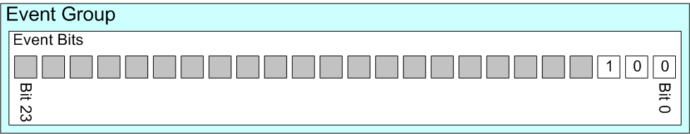

# EVENT GROUP | EFFICIENT TASK SYNCHRONIZATION AND STATUS MANAGEMENT

!!! NOTE "References"
    This document is based on the DURUOFU's ESP32-GUIDE. For more information, please refer to the original version: [DURUOFU ESP32-GUIDE](https://github.com/DuRuofu/ESP32-Guide).

!!! NOTE
    Event groups are a mechanism for implementing task communication and synchronization, mainly used to coordinate the execution of multiple tasks or interrupts.

**Event Bit (Event Flag):**
The event bit is used to indicate whether an event has occurred. The event bit is usually called an event flag. For example, an application can:
Define a bit (or flag), set to 1 to indicate "received a message and ready to process", set to 0 to indicate "no message waiting to be processed".
Define a bit (or flag), set to 1 to indicate "the task has completed the initialization", set to 0 to indicate "the task is not ready".

**Event Group:**
An event group is a collection of event bits. The event group is used to manage multiple event bits. The event group is usually called an event flag group. For example, an application can:
Event bit number 0 indicates "received a message and ready to process".
Event bit number 1 indicates "the task has completed the initialization".
Event bit number 2 indicates "the task is in the running state".

**Event Group and Event Bit Data Type:**

Event group is a data type of `EventGroupHandle_t`, and event bit is a data type of `EventBits_t`.

If configUSE_16_BIT_TICKS is set to 1, the number of bits (or flags) stored in the event group is 8; if configUSE_16_BIT_TICKS is set to 0, it is 24. The value of configUSE_16_BIT_TICKS depends on the data type used for thread-local storage in the task implementation.

> (The default value in ESP-IDF is 24 bits)

All event bits in the event group are stored in a single unsigned integer variable of type `EventBits_t`. Event bit 0 is stored in bit 0, event bit 1 is stored in bit 1, and so on.

The following figure shows a 24-bit event group, using 3 bits to save the 3 example events described earlier. In the image, only event bit 2 is set. (An event group with 24 event bits, of which only three are in use)



**Event Group RTOS API Functions**

The provided event group API functions allow tasks to set one or more event bits in the event group, clear one or more event bits in the event group, and suspend (enter a blocked state, so the task does not consume any processing time) to wait for one or more event bits in the event group to be set.

Event groups can also be used to synchronize tasks, creating what are typically called "collections" of tasks. A task synchronization point is a location in the application code where a task blocks, consuming no CPU time, waiting for all other tasks participating in the synchronization to reach their synchronization points.

### 1. API Description:

Event group operations mainly involve the following APIs:

| Function Name          | Functionality         | Remarks                        |
| ---------------------- | ---------------------- | ------------------------------ |
| xEventGroupCreate      | Create an event group  | Returns an event group handle for subsequent operations |
| xEventGroupSetBits     | Set one or more event flags | Used to notify other tasks that certain events have occurred |
| xEventGroupClearBits   | Clear one or more event flags | Used to reset event flags to prevent repeated triggering |
| xEventGroupWaitBits    | Wait for the set state of one or more event flags | Tasks can choose to block until the specified event occurs |
| xEventGroupGetBits     | Query the current state of the event group | Returns the current state of all event flags in the event group |
| xEventGroupSync        | Synchronize multiple tasks | Used to allow multiple tasks to continue execution

#### xEventGroupCreate: Create an Event Group

**Prototype:**

```c
EventGroupHandle_t xEventGroupCreate( void );
```

**Return Value:** If successful, the function returns a handle to the created event group. If the event group cannot be created, the function returns NULL.

**Example:**

```c
EventGroupHandle_t xEventGroup;
xEventGroup = xEventGroupCreate();
if (xEventGroup == NULL) {
    // Event group creation failed
}
```

#### xEventGroupSetBits: Set Event Bits

**Prototype:**

```c
EventBits_t xEventGroupSetBits( EventGroupHandle_t xEventGroup, const EventBits_t uxBitsToSet );
```

**Parameters:**

- `xEventGroup`: The handle of the event group in which the event bits are to be set.

- `uxBitsToSet`: The event bits to set.

**Return Value:** The function returns the event group status before being called.

#### xEventGroupWaitBits: Wait for Event Bits

Read the bits in the event group, selectively enter “blocked” state (if timeout value is set) to wait for setting one or more bits in the event group. Can not call this function in an interrupt service routine.

**Prototype:**

```c
EventBits_t xEventGroupWaitBits(
    EventGroupHandle_t xEventGroup,
    const EventBits_t uxBitsToWaitFor,
    const BaseType_t xClearOnExit,
    const BaseType_t xWaitForAllBits,
    TickType_t xTicksToWait
);
```

**Parameters:**

- `xEventGroup`: The handle of the event group to wait for.

- `uxBitsToWaitFor`: The event bits to wait for (bitwise representation).

- `xClearOnExit`: Whether to clear the specified event bits when exiting the wait.

- `xWaitForAllBits`: Whether to wait for all bits to be set.

- `xTicksToWait`: The maximum time to wait for the event bits to be set.

**Return Value:** The function returns the event status satisfying the conditions.

**Example:**

```c
EventBits_t uxBits;
uxBits = xEventGroupWaitBits(
    xEventGroup,      // Event group handle
    0x03,             // Wait for bit 0 and bit 1
    pdTRUE,           // Clear event bits when exiting the wait
    pdFALSE,          // Wait for any event
    portMAX_DELAY     // Wait indefinitely
)

if (uxBits & 0x01) {
    // Event 0 occurred
}

if (uxBits & 0x02) {
    // Event 1 occurred
}
```

#### xEventGroupSync：Synchronize Tasks

Atomically sets a bit (flag) in an RTOS event group and then waits for a combination of bits to be set in the same event group. This feature is often used to synchronize multiple tasks (often called task sets), where each task must wait for the others to reach a synchronization point before continuing.

**Prototype:**

```c
EventBits_t xEventGroupSync(
    EventGroupHandle_t xEventGroup,
    const EventBits_t uxBitsToSet,
    const EventBits_t uxBitsToWaitFor,
    TickType_t xTicksToWait
);
```

**Parameters:**

- `xEventGroup`: The handle of the event group to synchronize.

- `uxBitsToSet`: The event bits to set.

- `uxBitsToWaitFor`: The event bits set by other tasks to wait for.

- `xTicksToWait`: The maximum time to wait.

**Return Value:** The function returns the event status satisfying the conditions.

**Example:**

```c
xEventGroupSync(
    xEventGroup,  // Event group handle
    0x01,         // Set bit 0
    0x03,         // Wait for bit 0 and bit 1 to be set
    portMAX_DELAY // Wait indefinitely
);
```

### 2. Example Code:

#### 1. Event Group Waiting

Task 1 waiting for task2 to set the event bit, then execute the program:

```c
// EVENT GROUP WAITING

#include <stdio.h>
#include "esp_log.h"
#include "freertos/FreeRTOS.h"
#include "freertos/task.h"
#include "freertos/event_groups.h"

static const char *TAG = "main";

EventGroupHandle_t xCreatedEventGroup;

#define BIT_0 (1 << 0)
#define BIT_4 (1 << 4)

void task1(void *pvParameters)
{
    ESP_LOGI(TAG, "-------------------------------");
    ESP_LOGI(TAG, "task1 started!");

    while (1)
    {
        // Wait for BIT_0 or BIT_4 to be set in the event group
        EventBits_t uxBits;
        uxBits = xEventGroupWaitBits(
            xCreatedEventGroup, /* The event group being tested. */
            BIT_0 | BIT_4,      /* The bits within the event group to wait for. */
            pdTRUE,             /* BIT_0 & BIT_4 should be cleared before returning. */
            pdFALSE,            /* Don't wait for both bits, either bit will do. */
            portMAX_DELAY);     /* Wait indefinitely for either bit to be set. */

        // Check which bits are set
        if ((uxBits & (BIT_0 | BIT_4)) == (BIT_0 | BIT_4))
        {
            ESP_LOGI(TAG, "BIT_0 and BIT_4 are both set");
        }
        else
        {
            ESP_LOGI(TAG, "One of the bits (BIT_0 or BIT_4) is set");
        }
    }
}

void task2(void *pvParameters)
{
    ESP_LOGI(TAG, "task2 started!");
    vTaskDelay(pdMS_TO_TICKS(1000)); // Delay for 1 second
    while (1)
    {
        // Set BIT_0 in the event group
        xEventGroupSetBits(xCreatedEventGroup, BIT_0);
        ESP_LOGI(TAG, "BIT_0 is set");
        vTaskDelay(pdMS_TO_TICKS(3000)); // Delay for 3 seconds

        // Set BIT_4 in the event group
        xEventGroupSetBits(xCreatedEventGroup, BIT_4);
        ESP_LOGI(TAG, "BIT_4 is set");
        vTaskDelay(pdMS_TO_TICKS(3000)); // Delay for 3 seconds

        xEventGroupSetBits(xCreatedEventGroup, BIT_0 | BIT_4);
        ESP_LOGI(TAG, "ddd BIT_0 and BIT_4 are both set");
        vTaskDelay(pdMS_TO_TICKS(3000)); // Delay for 3 seconds
    }
}

void app_main(void)
{

    // create event group
    xCreatedEventGroup = xEventGroupCreate();

    if (xCreatedEventGroup == NULL)
    {
        ESP_LOGE(TAG, "create event group failed");
    }
    else
    {
        xTaskCreate(task1, "task1", 1024 * 2, NULL, 1, NULL);
        xTaskCreate(task2, "task2", 1024 * 2, NULL, 1, NULL);
    }
}// EVENT GROUP WAITING

#include <stdio.h>
#include "esp_log.h"
#include "freertos/FreeRTOS.h"
#include "freertos/task.h"
#include "freertos/event_groups.h"

static const char *TAG = "main";

EventGroupHandle_t xCreatedEventGroup;

#define BIT_0 (1 << 0)
#define BIT_4 (1 << 4)

void task1(void *pvParameters)
{
    ESP_LOGI(TAG, "-------------------------------");
    ESP_LOGI(TAG, "task1 started!");

    while (1)
    {
        // Wait for BIT_0 or BIT_4 to be set in the event group
        EventBits_t uxBits;
        uxBits = xEventGroupWaitBits(
            xCreatedEventGroup, /* The event group being tested. */
            BIT_0 | BIT_4,      /* The bits within the event group to wait for. */
            pdTRUE,             /* BIT_0 & BIT_4 should be cleared before returning. */
            pdFALSE,            /* Don't wait for both bits, either bit will do. */
            portMAX_DELAY);     /* Wait indefinitely for either bit to be set. */

        // Check which bits are set
        if ((uxBits & (BIT_0 | BIT_4)) == (BIT_0 | BIT_4))
        {
            ESP_LOGI(TAG, "BIT_0 and BIT_4 are both set");
        }
        else
        {
            ESP_LOGI(TAG, "One of the bits (BIT_0 or BIT_4) is set");
        }
    }
}

void task2(void *pvParameters)
{
    ESP_LOGI(TAG, "task2 started!");
    vTaskDelay(pdMS_TO_TICKS(1000)); // Delay for 1 second
    while (1)
    {
        // Set BIT_0 in the event group
        xEventGroupSetBits(xCreatedEventGroup, BIT_0);
        ESP_LOGI(TAG, "BIT_0 is set");
        vTaskDelay(pdMS_TO_TICKS(3000)); // Delay for 3 seconds

        // Set BIT_4 in the event group
        xEventGroupSetBits(xCreatedEventGroup, BIT_4);
        ESP_LOGI(TAG, "BIT_4 is set");
        vTaskDelay(pdMS_TO_TICKS(3000)); // Delay for 3 seconds

        xEventGroupSetBits(xCreatedEventGroup, BIT_0 | BIT_4);
        ESP_LOGI(TAG, "ddd BIT_0 and BIT_4 are both set");
        vTaskDelay(pdMS_TO_TICKS(3000)); // Delay for 3 seconds
    }
}

void app_main(void)
{

    // create event group
    xCreatedEventGroup = xEventGroupCreate();

    if (xCreatedEventGroup == NULL)
    {
        ESP_LOGE(TAG, "create event group failed");
    }
    else
    {
        xTaskCreate(task1, "task1", 1024 * 2, NULL, 1, NULL);
        xTaskCreate(task2, "task2", 1024 * 2, NULL, 1, NULL);
    }
}
```

#### 2. Event Group Synchronization

Task 1 sets BIT_0 and waits for BIT_1 to be set, while task 2 sets BIT_1 and waits for BIT_0 to be set, then executes the program:

```c
// EVENT GROUP SYNCHRONIZATION
#include <stdio.h>
#include "esp_log.h"
#include "freertos/FreeRTOS.h"
#include "freertos/task.h"
#include "freertos/event_groups.h"

/* Bits used by the three tasks. */
#define TASK_0_BIT (1 << 0)
#define TASK_1_BIT (1 << 1)
#define TASK_2_BIT (1 << 2)

#define ALL_SYNC_BITS (TASK_0_BIT | TASK_1_BIT | TASK_2_BIT)

static const char *TAG = "main";
EventGroupHandle_t xEventBits;


void task0(void *pvParameters)
{
    ESP_LOGI(TAG, "-------------------------------");
    ESP_LOGI(TAG, "task0 started!");

    while (1)
    {
        vTaskDelay(pdMS_TO_TICKS(3000));
        ESP_LOGI(TAG, "task0: task synchronization started");
        // Event synchronization
        xEventGroupSync(
            xEventBits,     /* The event group being tested. */
            TASK_0_BIT,     /* The bits within the event group to wait for. */
            ALL_SYNC_BITS,  /* The bits within the event group to wait for. */
            portMAX_DELAY); /* Wait a maximum of 100ms for either bit to be set. */

    ESP_LOGI(TAG, "task0: task synchronization completed");
        vTaskDelay(pdMS_TO_TICKS(3000));
    }
}
void task1(void *pvParameters)
{
    ESP_LOGI(TAG, "-------------------------------");
    ESP_LOGI(TAG, "task1 started!");

    while (1)
    {
        vTaskDelay(pdMS_TO_TICKS(4000));
        ESP_LOGI(TAG, "task1: task synchronization started");

        // Event synchronization
        xEventGroupSync(
            xEventBits,     /* The event group being tested. */
            TASK_1_BIT,     /* The bits within the event group to wait for. */
            ALL_SYNC_BITS,  /* The bits within the event group to wait for. */
            portMAX_DELAY); /* Wait a maximum of 100ms for either bit to be set. */

        ESP_LOGI(TAG, "task1: task synchronization completed");
        vTaskDelay(pdMS_TO_TICKS(3000));
    }
}

void task2(void *pvParameters)
{
    ESP_LOGI(TAG, "-------------------------------");
    ESP_LOGI(TAG, "task2 started!");

    while (1)
    {
        vTaskDelay(pdMS_TO_TICKS(5000));
        ESP_LOGI(TAG, "task2: task synchronization started");
        // Event synchronization
        xEventGroupSync(
            xEventBits,     /* The event group being tested. */
            TASK_2_BIT,     /* The bits within the event group to wait for. */
            ALL_SYNC_BITS,  /* The bits within the event group to wait for. */
            portMAX_DELAY); /* Wait a maximum of 100ms for either bit to be set. */

        ESP_LOGI(TAG, "task2: task synchronization completed");
        vTaskDelay(pdMS_TO_TICKS(3000));
    }
}


void app_main(void)
{
    // Create event group
    xEventBits = xEventGroupCreate();

    if (xEventBits == NULL)
    {
        ESP_LOGE(TAG, "Failed to create event group");
    }
    else
    {
        xTaskCreate(task0, "task0", 1024 * 2, NULL, 1, NULL);
        xTaskCreate(task1, "task1", 1024 * 2, NULL, 1, NULL);
        xTaskCreate(task2, "task2", 1024 * 2, NULL, 1, NULL);
    }
}

```

!!! note
    When a task calls the xEventGroupWaitBits function to wait for an event bit, if the event bit has been set, the task will be awakened and changed from the blocked state to the ready state, waiting for the scheduler to schedule it.