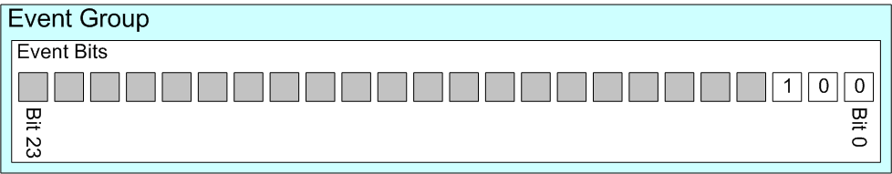

# 事件组 | 高效的任务同步与状态管理

!!! note "参考出处"
    本文档参考了DURUOFU的[ESP32-教程](https://github.com/DuRuofu/ESP32-Guide)。 

!!! note
    事件组是一种实现任务间通信和同步的机制，主要用于协调多个任务或中断之间的执行。


**事件位（事件标志）**：
事件位用于指示事件是否发生。事件位通常称为事件标志。例如，应用程序可以：
定义一个位（或标志）， 设置为 1 时表示“已收到消息并准备好处理”， 设置为 0 时表示“没有消息等待处理”。
定义一个位（或标志）， 设置为 1 时表示“应用程序已将准备发送到网络的消息排队”， 设置为 0 时表示 “没有消息需要排队准备发送到网络”。
定义一个位（或标志）， 设置为 1 时表示“需要向网络发送心跳消息”， 设置为 0 时表示“不需要向网络发送心跳消息”。

**事件组**：
事件组就是一组事件位。事件组中的事件位通过位编号来引用。同样，以上面列出的三个例子为例：
事件标志组位编号为 0 表示“已收到消息并准备好处理”。
事件标志组位编号为 1 表示“应用程序已将准备发送到网络的消息排队”。
事件标志组位编号为 2 表示“需要向网络发送心跳消息”。

**事件组和事件位数据类型**：

事件组由 EventGroupHandle_t 类型的变量引用。

如果 configUSE_16_BIT_TICKS 设为 1，则事件组中存储的位（或标志）数为 8； 如果 configUSE_16_BIT_TICKS 设为 0，则为 24。 configUSE_16_BIT_TICKS 的值取决于 任务内部实现中用于线程本地存储的数据类型。

> (ESP-IDF中默认为24位)

事件组中的所有事件位都存储在 EventBits_t 类型的单个无符号整数变量中。事件位 0 存储在位 0 中， 事件位 1 存储在位1 中，依此类推。

下图表示一个 24 位事件组， 使用 3 个位来保存前面描述的 3 个示例事件。在图片中，仅设置了事件位 2。（包含 24 个事件位的事件组，其中只有三个在使用中）




**事件组 RTOS API 函数**

提供的事件组 API 函数允许任务在事件组中设置一个或多个事件位， 清除事件组中的一个或多个事件位，并挂起（进入阻塞状态, 因此任务不会消耗任何处理时间）以等待事件组中一个或多个事件位固定下来。

事件组也可用于同步任务， 创建通常称为“集合”的任务。任务同步点是应用程序代码中的一个位置，在该位置任务将在阻塞状态（不消耗任何 CPU 时间）下等待，直到参与同步的所有其他任务也到达其同步点。


### 1. API说明：

事件组操作主要涉及以下几个 API：

| 函数名                  | 功能               | 备注                        |
| -------------------- | ---------------- | ------------------------- |
| xEventGroupCreate    | 创建一个事件组          | 返回一个事件组句柄，供后续操作使用         |
| xEventGroupSetBits   | 设置一个或多个事件标志      | 用于通知其他任务某些事件已发生           |
| xEventGroupClearBits | 清除一个或多个事件标志      | 用于复位事件标志，防止重复触发           |
| xEventGroupWaitBits  | 等待一个或多个事件标志的设置状态 | 任务可以选择阻塞，直到指定事件发生         |
| xEventGroupGetBits   | 查询当前事件组的状态       | 返回事件组中所有事件标志的当前状态         |
| xEventGroupSync      | 同步多个任务           | 用于实现多个任务在同一时刻达到某一同步点后继续执行 |

#### xEventGroupCreate：创建事件组

**原型：**

```c
EventGroupHandle_t xEventGroupCreate(void);
```

**返回值**：成功时返回事件组句柄；失败时返回 NULL。

**示例：**

```c
EventGroupHandle_t xEventGroup;
xEventGroup = xEventGroupCreate();
if (xEventGroup == NULL) {
    // 创建事件组失败，处理错误
}
```

#### xEventGroupSetBits：设置事件标志

**原型：**
```c
EventBits_t xEventGroupSetBits(EventGroupHandle_t xEventGroup, const EventBits_t uxBitsToSet);
```

**参数说明**：

- xEventGroup：事件组句柄。

- uxBitsToSet：需要设置的事件标志位（按位表示，例如 0x01 设置第 0 位）。

**返回值**：返回事件组在调用前的状态。

#### xEventGroupWaitBits：等待事件标志

读取 RTOS 事件组中的位，选择性地进入“阻塞”状态（已设置 超时值）以等待设置单个位或一组位。无法从中断调用此函数。

**原型：**

```c
EventBits_t xEventGroupWaitBits(
    EventGroupHandle_t xEventGroup,
    const EventBits_t uxBitsToWaitFor,
    const BaseType_t xClearOnExit,
    const BaseType_t xWaitForAllBits,
    TickType_t xTicksToWait
);
```

**参数说明：**

- xEventGroup：事件组句柄。

- uxBitsToWaitFor：需要等待的事件标志位（按位表示）。

- xClearOnExit：是否在退出等待时清除指定的事件标志。

- xWaitForAllBits：是否等待所有指定事件标志都被设置，还是任意一个即可。

- xTicksToWait：等待的最大时间（以 Tick 为单位，portMAX_DELAY 表示无限等待）。

**返回值**：返回当前满足条件的事件标志状态。

**示例**：

```c
EventBits_t uxBits;
uxBits = xEventGroupWaitBits(
    xEventGroup,      // 事件组句柄
    0x03,             // 等待第 0 位和第 1 位
    pdTRUE,           // 退出等待时清除事件标志
    pdFALSE,          // 等待任意一个事件
    portMAX_DELAY     // 无限等待
);

if (uxBits & 0x01) {
    // 第 0 位事件发生
}

if (uxBits & 0x02) {
    // 第 1 位事件发生
}
```

#### xEventGroupSync：同步任务

以原子方式设置 RTOS 事件组中的位（标志），然后等待在同一事件组中设置位的组合。此功能通常用于同步多个任务（通常称为任务集合），其中每个任务必须等待其他任务到达同步点后才能继续。

**原型**：
```c
EventBits_t xEventGroupSync(
    EventGroupHandle_t xEventGroup,
    const EventBits_t uxBitsToSet,
    const EventBits_t uxBitsToWaitFor,
    TickType_t xTicksToWait
);
```
**参数说明**：

- xEventGroup：事件组句柄。

- uxBitsToSet：当前任务设置的事件标志位。

- uxBitsToWaitFor：需要等待的其他任务设置的事件标志位。

- xTicksToWait：最大等待时间。

**返回值**：

返回事件组的当前状态。

**示例**：

```c
xEventGroupSync(
    xEventGroup,  // 事件组句柄
    0x01,         // 当前任务设置第 0 位
    0x03,         // 等待第 0 位和第 1 位都被设置
    portMAX_DELAY // 无限等待
);
```

### 2 示例程序：

#### 1. 事件组等待

task1等待task2设置事件位，然后执行程序：

```c
// 事件组
#include <stdio.h>
#include "esp_log.h"
#include "freertos/FreeRTOS.h"
#include "freertos/task.h"
#include "freertos/event_groups.h"

static const char *TAG = "main";

EventGroupHandle_t xCreatedEventGroup;

#define BIT_0 (1 << 0)
#define BIT_4 (1 << 4)

void task1(void *pvParameters)
{
    ESP_LOGI(TAG, "-------------------------------");
    ESP_LOGI(TAG, "task1启动!");

    while (1)
    {
        EventBits_t uxBits;
        uxBits = xEventGroupWaitBits(
            xCreatedEventGroup, /* The event group being tested. */
            BIT_0 | BIT_4,      /* The bits within the event group to wait for. */
            pdTRUE,             /* BIT_0 & BIT_4 should be cleared before returning. */
            pdFALSE,            /* Don't wait for both bits, either bit will do. */
            portMAX_DELAY);     /* Wait a maximum of 100ms for either bit to be set. */

        if ((uxBits & (BIT_0 | BIT_4)) == (BIT_0 | BIT_4))
        {
            ESP_LOGI(TAG, "BIT_0 和 BIT_4 都被设置了");
        }
        else
        {
            ESP_LOGI(TAG, "BIT_0 和 BIT_4 有一个被设置了");
        }
    }
}

void task2(void *pvParameters)
{
    ESP_LOGI(TAG, "task2启动!");
    vTaskDelay(pdMS_TO_TICKS(1000));
    while (1)
    {
        xEventGroupSetBits(xCreatedEventGroup, BIT_0);
        ESP_LOGI(TAG, "BIT_0 被设置");
        vTaskDelay(pdMS_TO_TICKS(3000));
        xEventGroupSetBits(xCreatedEventGroup, BIT_4);
        ESP_LOGI(TAG, "BIT_4 被设置");
        vTaskDelay(pdMS_TO_TICKS(3000));
        xEventGroupSetBits(xCreatedEventGroup, BIT_0 | BIT_4);
        ESP_LOGI(TAG, "BIT_0 和 BIT_4 都被设置");
        vTaskDelay(pdMS_TO_TICKS(3000));
    }
}

void app_main(void)
{

    // 创建事件组
    xCreatedEventGroup = xEventGroupCreate();

    if (xCreatedEventGroup == NULL)
    {
        ESP_LOGE(TAG, "创建事件组失败");
    }
    else
    {
        xTaskCreate(task1, "task1", 1024 * 2, NULL, 1, NULL);
        xTaskCreate(task2, "task2", 1024 * 2, NULL, 1, NULL);
    }
}
```
#### 2. 事件组同步

每个任务在启动后，等待一段时间，然后调用xEventGroupSync函数进行事件同步，等待所有任务的事件位都被设置。
```c
// 事件组
#include <stdio.h>
#include "esp_log.h"
#include "freertos/FreeRTOS.h"
#include "freertos/task.h"
#include "freertos/event_groups.h"

/* Bits used by the three tasks. */
#define TASK_0_BIT (1 << 0)
#define TASK_1_BIT (1 << 1)
#define TASK_2_BIT (1 << 2)

#define ALL_SYNC_BITS (TASK_0_BIT | TASK_1_BIT | TASK_2_BIT)

static const char *TAG = "main";
EventGroupHandle_t xEventBits;


void task0(void *pvParameters)
{
    ESP_LOGI(TAG, "-------------------------------");
    ESP_LOGI(TAG, "task0启动!");

    while (1)
    {
        vTaskDelay(pdMS_TO_TICKS(3000));
        ESP_LOGI(TAG, "task0: 任务同步开始");
        // 事件同步
        xEventGroupSync(
            xEventBits,     /* The event group being tested. */
            TASK_0_BIT,     /* The bits within the event group to wait for. */
            ALL_SYNC_BITS,  /* The bits within the event group to wait for. */
            portMAX_DELAY); /* Wait a maximum of 100ms for either bit to be set. */

    ESP_LOGI(TAG, "task0: 任务同步完成");
    vTaskDelay(pdMS_TO_TICKS(3000));
    }
}
void task1(void *pvParameters)
{
    ESP_LOGI(TAG, "-------------------------------");
    ESP_LOGI(TAG, "task1启动!");

    while (1)
    {
        vTaskDelay(pdMS_TO_TICKS(4000));
        ESP_LOGI(TAG, "task1: 任务同步开始");

        // 事件同步
        xEventGroupSync(
            xEventBits,     /* The event group being tested. */
            TASK_1_BIT,     /* The bits within the event group to wait for. */
            ALL_SYNC_BITS,  /* The bits within the event group to wait for. */
            portMAX_DELAY); /* Wait a maximum of 100ms for either bit to be set. */

        ESP_LOGI(TAG, "task1: 任务同步完成");
        vTaskDelay(pdMS_TO_TICKS(3000));
    }
}

void task2(void *pvParameters)
{
    ESP_LOGI(TAG, "-------------------------------");
    ESP_LOGI(TAG, "task2启动!");

    while (1)
    {
        vTaskDelay(pdMS_TO_TICKS(5000));
        ESP_LOGI(TAG, "task2: 任务同步开始");
        // 事件同步
        xEventGroupSync(
            xEventBits,     /* The event group being tested. */
            TASK_2_BIT,     /* The bits within the event group to wait for. */
            ALL_SYNC_BITS,  /* The bits within the event group to wait for. */
            portMAX_DELAY); /* Wait a maximum of 100ms for either bit to be set. */

        ESP_LOGI(TAG, "task2: 任务同步完成");
        vTaskDelay(pdMS_TO_TICKS(3000));
    }
}


void app_main(void)
{
    // 创建事件组
    xEventBits = xEventGroupCreate();

    if (xEventBits == NULL)
    {
        ESP_LOGE(TAG, "创建事件组失败");
    }
    else
    {
        xTaskCreate(task0, "task0", 1024 * 2, NULL, 1, NULL);
        xTaskCreate(task1, "task1", 1024 * 2, NULL, 1, NULL);
        xTaskCreate(task2, "task2", 1024 * 2, NULL, 1, NULL);
    }
}

```

!!! note "任务被唤醒"
    任务在调用xEventGroupWaitBits函数等待事件位时，如果事件位已经被设置，任务会被唤醒，从阻塞状态变成就绪状态，等待调度器调度。