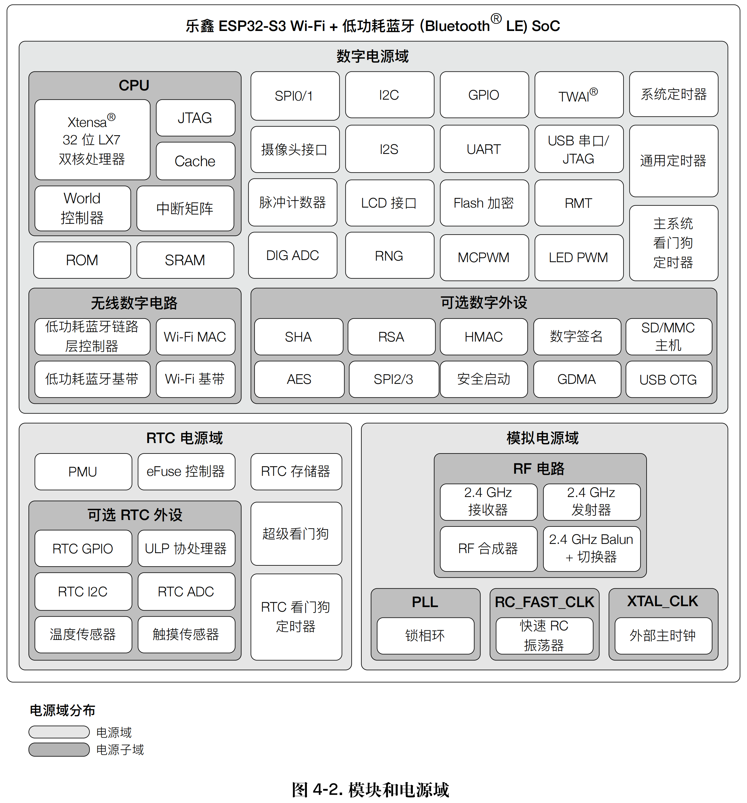

# 硬件平台

{width=800px}

{width=800px}

{width=800px}

{width=800px}

!!! info "DNESP32S3M"
    本文档使用的硬件平台为正点原子的DNESP32S3M,基于ESP32-S3，如上图所示。相关程序迁移到其他开发板应该也是可以的，但是需要根据实际情况进行适配。

!!! info "DNESP32S3M 硬件特性"
    ESP32-S3 SoC 芯片支持以下功能：

    - 2.4 GHz Wi-Fi

    - 低功耗蓝牙

    - 高性能 Xtensa® 32 位 LX7 双核处理器

    - 运行 RISC-V 或 FSM 内核的超低功耗协处理器

    - 多种外设

    - 内置安全硬件

    - USB OTG 接口

    - USB 串口/JTAG 控制器

    ESP32-S3 采用 40 nm 工艺制成，具有最佳的功耗性能、射频性能、稳定性、通用性和可靠性，适用于各种应用场景和不同功  耗需求。

    乐鑫为用户提供完整的软、硬件资源，进行 ESP32-S3 硬件设备的开发。其中，乐鑫的软件开发环境 ESP-IDF 旨在协助用户快 速开发物联网 (IoT) 应用，可满足用户对 Wi-Fi、蓝牙、低功耗等方面的要求。

!!! note
    开始编程前，您需要：

    - 一台带有 USB 端口的计算机

    - 一根 USB 数据线
  
    - 一块 DNESP32S3M 开发板或其他 ESP32 开发板
