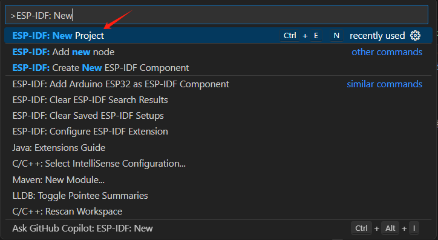

# 模板项目搭建

## 环境准备

!!! info
    我们使用 VSCode + ESP-IDF 进行开发。有关设置开发环境的详细信息可以在互联网上找到。我假设您已经设置好了开发环境。

## 创建新项目

1. 启动 VSCode，然后通过按 `Ctrl+Shift+P`（Windows/Linux）或 `Cmd+Shift+P`（macOS）打开命令面板。
2. 输入 `ESP-IDF: New Project` 并按 `Enter`。
{ width=600px }
3. 进入项目配置 UI 并填写所需信息。
{ width=800px }
4. 选择一个模板来创建新项目。
{ width=800px }
5. 在新窗口中打开。
{ width=400px }
{ width=800px }

## 模板化项目结构
```bash
sample_proj/ # 项目根目录
├── CMakeLists.txt # 项目 CMake 配置文件
├── main/ # 主应用程序目录
│   ├── CMakeLists.txt # 应用程序 CMake 配置文件
│   └── main.c # 应用程序源文件
└── sdkconfig # 项目配置文件
```

## 项目配置

!!! note
    这一步是为了配置项目设置以最大化硬件的性能，即使用特定于目标的配置而不是默认配置。

!!! warning
    在打开项目配置 UI 之前，请确保您已在 VSCode 中打开了项目，**将目标设置为对应的板子**，并安装了 ESP-IDF 扩展。

1. 通过按 `Ctrl+Shift+P`（Windows/Linux）或 `Cmd+Shift+P`（macOS）并输入 `ESP-IDF: Configure Project` 进入项目配置 UI。或者，可以点击 VSCode 窗口底部菜单的齿轮图标。
{ width=800px }
2. 'FLASH' 配置。在搜索栏中输入 `flash` 并按 `Enter`。
{ width=800px }
3. 'Partition Table' 配置。在搜索栏中输入 `partition` 并按 `Enter`。
{ width=800px }
详细信息稍后提供
4. 'PSRAM' 配置。在搜索栏中输入 `psram` 并按 `Enter`。
{ width=800px }
5. 更改 CPU 频率。在搜索栏中输入 `cpu` 并按 `Enter`。将 CPU 频率修改为 240 MHz。
{ width=600px }
1. 修改 FreeRTOS tick 时钟频率。在搜索栏中输入 `tick` 并按 `Enter`。将频率修改为 1000。
{ width=600px }
1. 修改分区表。在命令面板中输入 `ESP-IDF: Open Partition Table Editor UI`。
{ width=500px }
1. 修改分区表如下所示。
{ width=800px }
1. 保存所有修改。

到目前为止，我们已经完成了项目初始化。配置信息现在与硬件板上资源一致。

## 模板程序

现在，让我们创建一个简单的程序来测试板子。

转到 main.c 文件并用以下代码替换内容：

```c
#include "freertos/FreeRTOS.h"
#include "freertos/task.h"
#include "nvs_flash.h"
#include "esp_system.h"
#include "esp_chip_info.h"
#include "esp_psram.h"
#include "esp_flash.h"

/**
 * @brief Entry point of the program
 * @param None
 * @retval None
 */
void app_main(void)
{
    esp_err_t ret;
    uint32_t flash_size;
    esp_chip_info_t chip_info;

    // Initialize NVS
    ret = nvs_flash_init();
    if (ret == ESP_ERR_NVS_NO_FREE_PAGES || ret == ESP_ERR_NVS_NEW_VERSION_FOUND)
    {
        ESP_ERROR_CHECK(nvs_flash_erase()); // Erase if needed
        ret = nvs_flash_init();
    }

    // Get FLASH size
    esp_flash_get_size(NULL, &flash_size);
    esp_chip_info(&chip_info);

    // Display CPU core count
    printf("CPU Cores: %d\n", chip_info.cores);

    // Display FLASH size
    printf("Flash size: %ld MB flash\n", flash_size / (1024 * 1024));

    // Display PSRAM size
    printf("PSRAM size: %d bytes\n", esp_psram_get_size());

    while (1)
    {
        printf("Hello-ESP32\r\n");
        vTaskDelay(1000);
    }
}
```

然后，确保串口正确，板子设置正确，然后编译并烧录程序。然后，你应该会看到串口输出显示开发板信息和 `Hello-ESP32` 消息。

## 结论

!!! note
    这个项目对DNESP32S3M最小系统板进行了初始化，并且可以为后续开发提供一个非常有用的模板。相比较与STM32，ESP32的开发隐藏了许多细节，同时也使得设置流程更加简单。